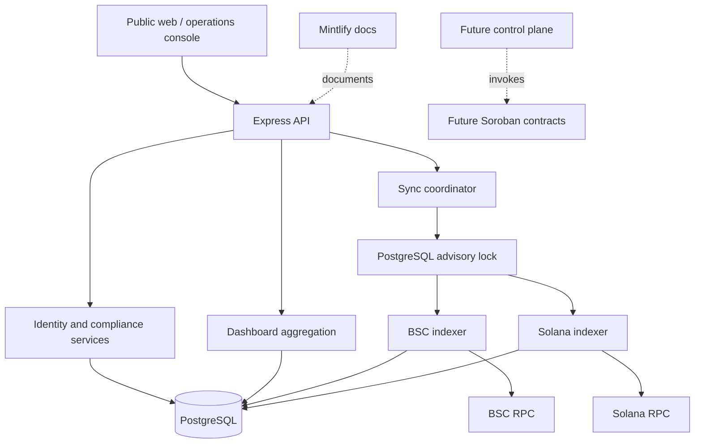

## Runtime topology

## Package ownership

| Workspace | Responsibility |
| --- | --- |
| `@oynk/shared` | Cross-package TypeScript contracts for dashboard, auth, organizations, and compliance |
| `@oynk/api` | Input validation, authorization, identity, compliance, indexing, synchronization, aggregation, and PostgreSQL access |
| `@oynk/web` | Public site and indexed-activity presentation |
| `@oynk/console` | Account access and organization-specific operations experience |
| `@oynk/docs` | Mintlify configuration and MDX documentation |

Web packages do not import API internals. Shared contracts live in `@oynk/shared`; business logic remains server-side.

## Deployment units

The API, indexer worker, web applications, documentation, and database should deploy independently. The current API process schedules synchronization itself; production scale should move chain work to separately deployable workers using leases or partitions while retaining deterministic identities.
