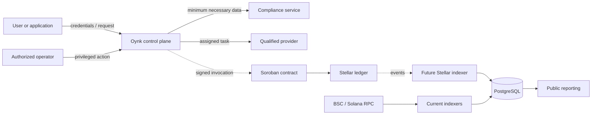

## Boundary rules

1. Authentication proves a user/session; organization membership and permission checks authorize an action.
2. Personal and compliance data remain off-chain. Contracts receive references, commitments, or hashes only when the privacy and retention model is defined.
3. Providers are trusted only for their assigned leg and must provide verifiable evidence.
4. Chain consensus proves accepted ledger state, not the truth of an off-chain payout.
5. RPC responses are untrusted external input. Indexers validate addresses, assets, status, and deterministic identity before persistence.
6. Public reports minimize identifying data and do not expose credentials or sensitive provider evidence.

## Current authentication controls

Passwords use scrypt with per-password salts. OTP and session secrets are HMAC-hashed with an environment pepper. Sessions use an HTTP-only cookie, expire, can be revoked, and include a separate CSRF token for state changes. Return paths are constrained to safe local paths. Rate limiting is process-local today and requires a shared enforcement layer when horizontally scaled.