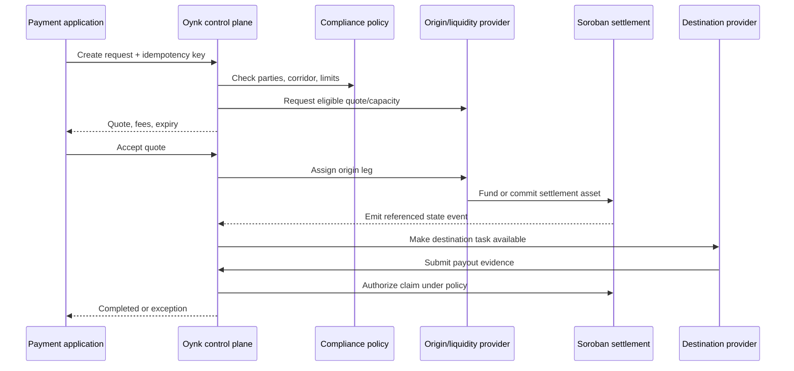

<Warning>This lifecycle is the target architecture. The current repository does not implement payment creation, quoting, provider assignment, Soroban funding, or payout execution APIs.</Warning>

## Required state principles

- Every create and accept operation is idempotent.
- Money amounts use exact decimal or integer representations.
- Quote expiry, fees, slippage, partial funding, and cancellation are explicit.
- Compliance and corridor eligibility are rechecked at the policy-defined gates.
- Provider assignment is a recorded commitment, not an informal side effect.
- On-chain and provider events carry the same settlement reference.
- Completion requires verified evidence for every required leg.

## Exception paths

Expired quotes require requoting. Underfunding requires an explicit top-up, accept-partial, refund, or cancel rule. Missed provider deadlines can move the request to reassignment, refund, or dispute. Contract claims and refunds must be mutually exclusive under a well-defined state machine.
