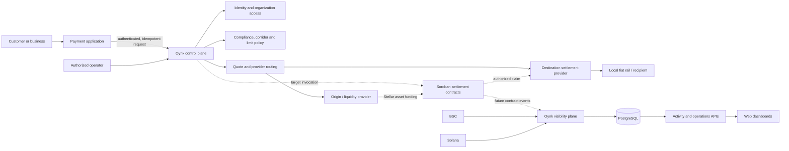
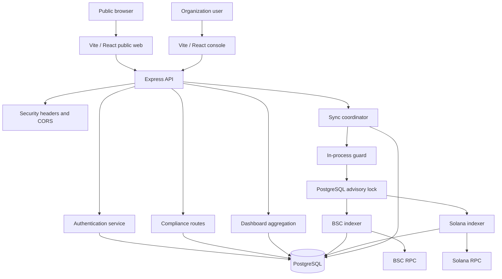
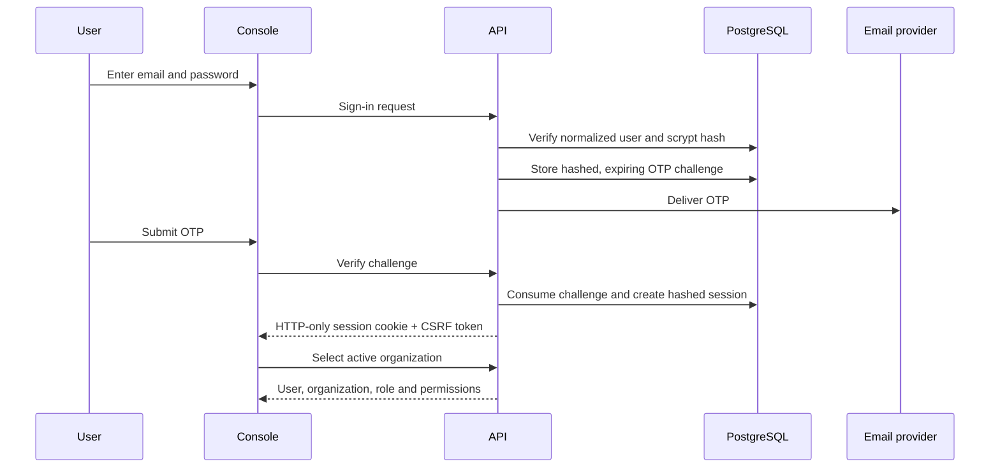
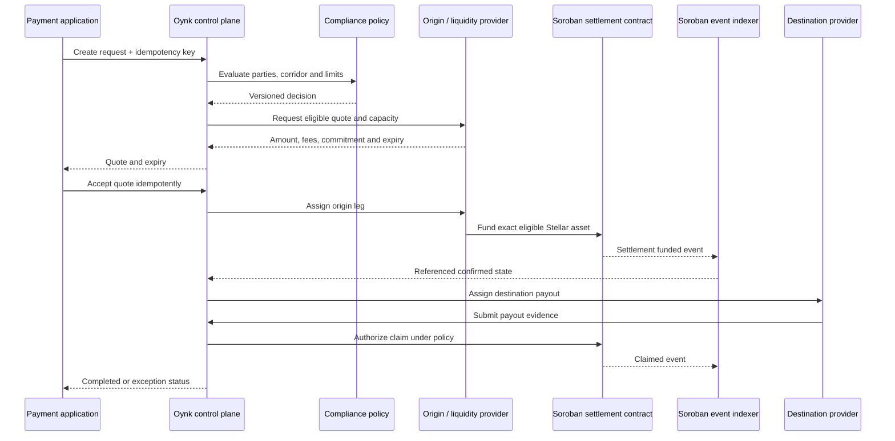
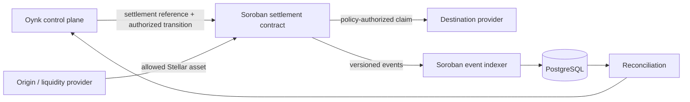
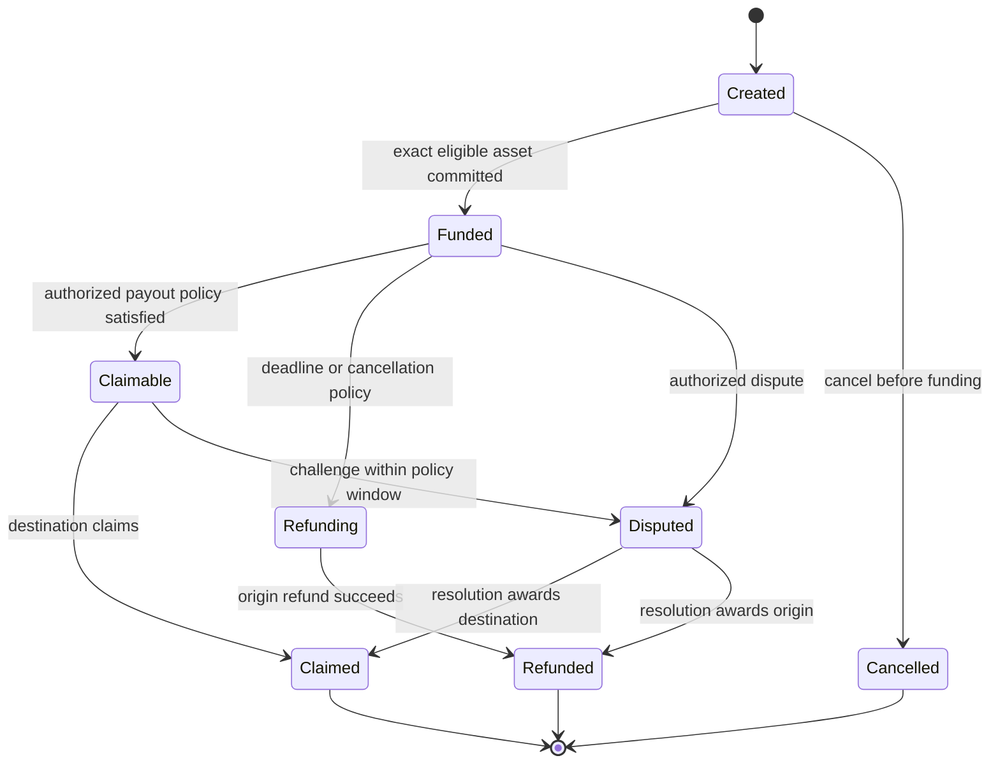
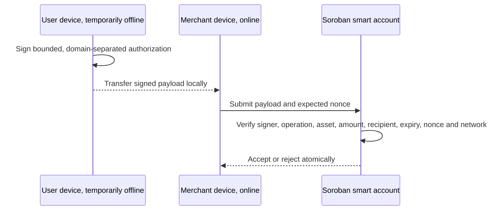
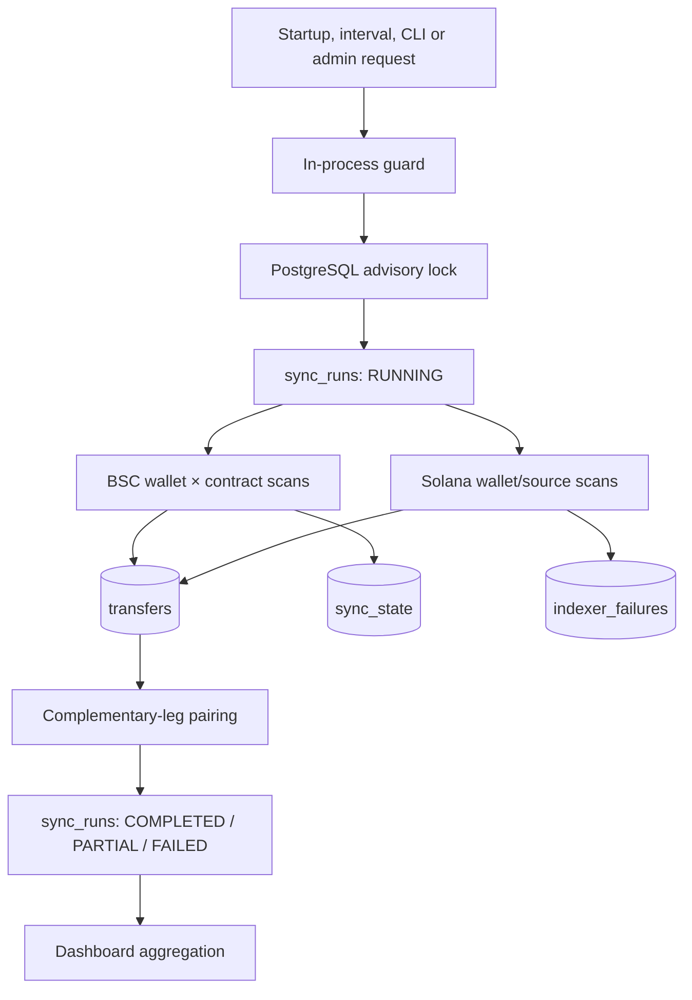
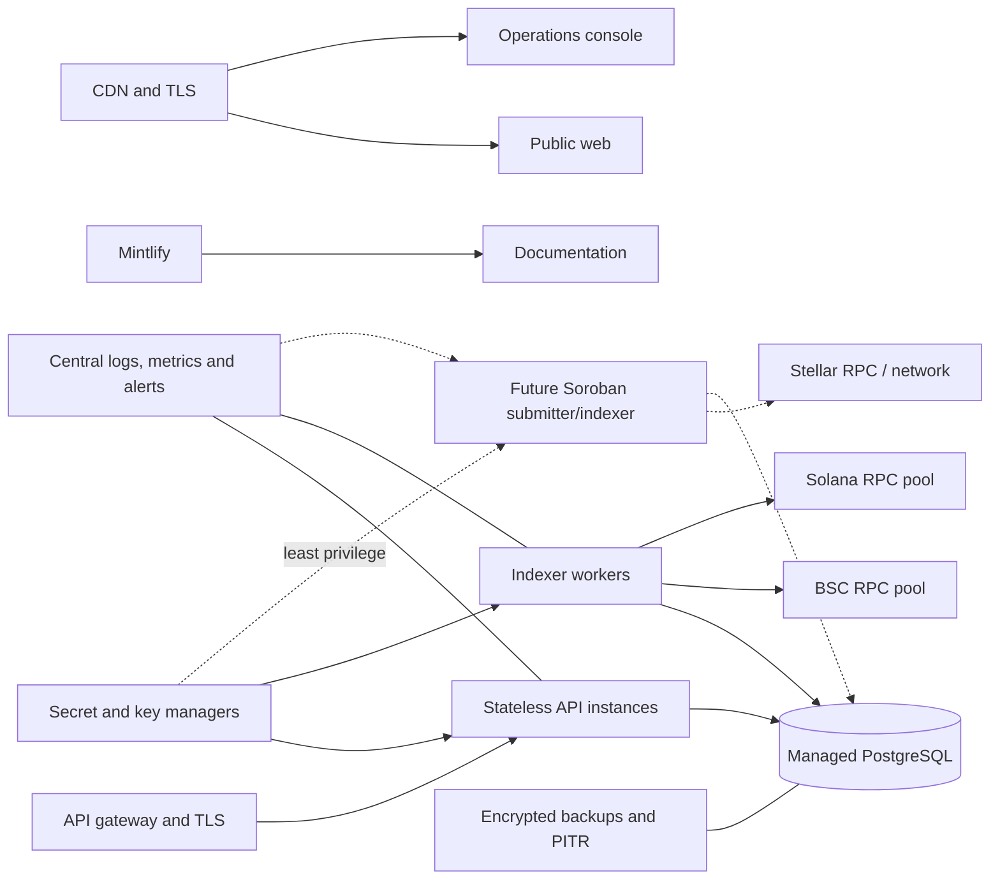

# Oynk full technical architecture

**Architecture status:** Working architecture, August 2026.

This document consolidates Oynk's complete technical architecture into one review surface. It covers the implemented monorepo, identity and compliance foundation, BSC and Solana visibility plane, data and API boundaries, operational controls, and the proposed Stellar and Soroban payment-settlement architecture.

<Warning>
  **Implementation boundary:** The repository currently implements identity, organization access, a business-compliance draft flow, BSC and Solana indexing, PostgreSQL persistence, synchronization controls, aggregate activity APIs, and web interfaces. It does not currently contain Stellar SDK integration, Soroban contracts, smart accounts, payment orchestration, quote routing, provider assignment, or fiat payout connectors. Those sections define the target architecture and required controls, not deployed behavior.
</Warning>

## 1. Executive summary

Oynk is designed as programmable infrastructure between payment demand and local financial capability. Payment applications use a consistent lifecycle while qualified liquidity and settlement providers execute corridor-specific collection, conversion, digital-asset, and payout legs.

The architecture separates five concerns:

1. **Experience:** public web, payment experiences, and organization-specific operations consoles.
2. **Control plane:** identity, authorization, exact-value validation, compliance policy, quotes, provider selection, payment state, and authoritative references.
3. **Provider plane:** qualified participants that supply liquidity, banking connectivity, collection, exchange, and destination payout.
4. **Settlement plane:** the proposed Stellar asset rail and Soroban contracts governing funding, commitments, claims, refunds, and disputes.
5. **Visibility plane:** chain indexers, normalized PostgreSQL records, reconciliation, metrics, and operational dashboards.

The design deliberately separates observed blockchain movement from verified business settlement. A chain transaction proves accepted ledger activity; it does not prove customer authorization, provider eligibility, fiat delivery, or end-to-end payment completion.

## 2. Goals and non-goals

### Goals

- Give payment applications one stable, idempotent lifecycle across multiple providers and corridors.
- Apply identity, authorization, compliance, limit, and route policy before value-changing actions.
- Treat all monetary values exactly, without floating-point arithmetic.
- Use authoritative references across payment, provider, contract, chain, and reconciliation records.
- Make on-chain settlement transitions explicit, auditable, replay-safe, and privacy-conscious.
- Observe supported blockchain activity durably across reorganizations, duplicates, RPC limits, and partial failures.
- Keep providers modular so a provider can be added, suspended, or replaced without redesigning application integrations.
- Operate under least privilege with durable audit, monitoring, recovery, and incident controls.

### Non-goals

Oynk does not replace local licensing, sanctions obligations, banking connectivity, provider due diligence, liquidity commitments, dispute operations, or legal analysis. A public dashboard is not a ledger of legally final customer payments. Soroban cannot independently establish an off-chain payout fact without evidence supplied through an authorized policy boundary.

## 3. System context

Solid paths through identity, BSC/Solana indexing, PostgreSQL, APIs, and web views have implemented foundations. Dotted Stellar/Soroban and payment-orchestration paths are proposed.

## 4. Repository and package architecture

Oynk is a pnpm workspace with strict package ownership.

| Workspace | Technical ownership |
| --- | --- |
| `@oynk/shared` | Cross-package TypeScript domain contracts and response types |
| `@oynk/api` | Express HTTP service, validation, authorization, identity, compliance, PostgreSQL access, indexing, synchronization, and aggregation |
| `@oynk/web` | Public website and indexed-activity presentation |
| `@oynk/console` | Authenticated signup, access, verification, and organization-specific operations UI |
| `@oynk/docs` | Mintlify configuration, consolidated architecture, MDX guides, branding, and OpenAPI reference |

Shared models belong in `@oynk/shared`. Business rules and authorization remain in `@oynk/api`. Presentation packages consume shared contracts and never import API internals. Future Soroban contracts should have a clearly owned Rust workspace, deterministic tests, generated bindings, deployment manifests, and source-to-bytecode verification.

## 5. Implemented runtime architecture

The API validates environment configuration at startup. It exposes liveness, readiness, public activity, synchronization, authentication, and compliance routes. When enabled, synchronization runs after startup and on a configured interval. Production scaling should extract indexing into dedicated workers instead of coupling scheduled work to an API instance.

## 6. Experience and presentation layer

The public web application provides Oynk's website and settlement-activity dashboard. The dashboard separates gross blockchain movement from reference-paired estimated settlement, shows inflows and outflows, exposes sync timestamps and timeline activity, and links on-chain observations to explorers.

The authenticated console supports business and settlement-partner signup, email verification, password-plus-OTP sign-in, organization selection, role-specific shells, and business-compliance draft entry. Payment, payout, settlement, provider, liquidity, corridor, terminal, reconciliation, webhook, API-key, and full internal review destinations are not complete transactional products. They remain empty, disabled, or informational until their server APIs and authorization contracts exist.

Business logic must not migrate into React components. UI authorization improves usability but never replaces server enforcement.

## 7. Identity, tenant, and authorization model

### Users and organizations

Users and organizations are distinct records. A user can hold organization memberships; a session selects one active organization and receives the corresponding role and resolved permission list.

Organization types are:

- `BUSINESS`
- `SETTLEMENT_PARTNER`
- `INTERNAL`

Organization lifecycle includes draft, email-verification-required, compliance-incomplete, submitted, under-review, additional-information-required, approved, active, rejected, suspended, and closed states. `SANDBOX`, `TEST`, and `LIVE` platform modes separate environments and operational authority.

### Authentication flow

Passwords use scrypt with per-password salts. OTP and session secrets are stored as keyed hashes using an environment pepper. OTPs have expiry, attempt limits, and resend cooldowns. Sessions expire, can be revoked, and carry a distinct CSRF secret. Return paths are constrained to safe local paths. Authentication rate limiting is process-local today and must move to shared gateway or datastore enforcement before horizontal scaling.

### Authorization

Roles map to fine-grained permissions for payments, payouts, terminals, settlements, liquidity, compliance, organization management, members, developer tooling, audit, indexing, applications, and account activation. Every sensitive server route must authenticate the session, resolve the active organization, require the correct permission, and enforce CSRF for cookie-authenticated state changes.

## 8. Compliance architecture

The implemented business profile flow validates legal name, registration information, ISO country codes, incorporation date, tax identifier, website, industry, business description, address, expected volume, expected transactions, and source of funds. A save operation atomically updates the organization, upserts the profile, and records an audit event.

The target control plane adds:

- KYC/KYB and beneficial-owner verification
- Sanctions and politically exposed person screening where required
- Transaction monitoring and case management
- Corridor, currency, asset, provider, and amount/frequency eligibility
- Evidence retention and Travel Rule exchange where applicable
- Versioned decisions linked to payments and assignments

Personal data remains off public chains. On-chain state should contain only stable non-personal references or deliberately designed commitments. The architecture does not imply licensing or approval in any jurisdiction.

## 9. Target payment control plane

The control plane is authoritative for customer intent and business lifecycle. It owns:

- Idempotent payment creation
- Exact origin and destination amounts
- Currency, asset, chain, recipient, and corridor validation
- Quote requests, fees, rate locks, expiry, and slippage
- Compliance and limit decisions
- Provider eligibility, capacity, selection, and assignment
- Funding instructions and deadlines
- Settlement, payout, evidence, exception, refund, and dispute state
- Stable payment, settlement, corridor, and leg references
- Auditable state transitions

Indexers must never create or authorize payment state by observing a similar amount and timestamp.

## 10. Proposed end-to-end payment lifecycle

Completion requires all required legs and evidence. Quote acceptance, funding, provider evidence, on-chain claims, and retries must be idempotent. Expired quotes require requoting. Partial funding requires an explicit top-up, partial acceptance, cancellation, or refund rule. Provider failure can trigger reassignment, refund, or dispute only through defined transitions.

## 11. Provider network architecture

Providers are modular participants, not implicitly trusted extensions of Oynk. Each production profile needs legal/KYB status, beneficial ownership, corridor and currency eligibility, supported assets and rails, banking capability, operating hours, limits, liquidity or collateral policy, pricing, service levels, evidence requirements, contacts, suspension state, and exit procedure.

Assignment filters by eligibility before comparing capacity, price, completion history, concentration, and operational risk. Provider performance should measure verified acceptance, completion time, quote reliability, evidence quality, exception and dispute rates, reconciliation gaps, and availability.

Fiat connectors should expose idempotent create, status, evidence, cancel, and reconcile operations behind provider-specific adapters. A provider callback is untrusted input until authenticated, validated, deduplicated, and correlated to the correct assignment.

## 12. Stellar and Soroban target architecture

Stellar is the proposed asset settlement rail. Soroban is the proposed programmable policy boundary for referenced settlement state. Customer identity, provider due diligence, quote calculation, route selection, compliance reasoning, and detailed fiat evidence remain off-chain.

Before implementation, Oynk must decide network selection, asset and issuer allowlists, trustline requirements, token contract identity, contract ownership, upgrade governance, authorization graph, storage and event schema, fee sponsorship, sequence handling, timebounds, partial funding, dispute authority, emergency pause, recovery, and data retention.

RPC URLs, issuers, network passphrases, contract IDs, explorers, and signers must be environment-specific validated configuration. Testnet and mainnet identifiers must never mix.

## 13. Proposed Soroban settlement contract

### State machine

### Minimum record

| Field | Function |
| --- | --- |
| `settlement_id` | Unique, stable, non-personal control-plane reference |
| `asset` | Network-scoped asset identity, not a symbol alone |
| `amount` | Exact integer amount under canonical precision rules |
| `origin` and `destination` | Authorized Stellar account or contract addresses |
| `created_at`, `fund_by`, `claim_by` | Ledger-aware time conditions |
| `route_commitment` | Reference/hash for versioned off-chain terms |
| `evidence_commitment` | Optional privacy-preserving evidence commitment |
| `state` | Enumerated lifecycle state |
| authorization policy | Principals allowed to fund, enable, claim, cancel, refund, dispute, resolve, pause, or upgrade |

### Contract invariants

- Settlement identifiers cannot be reused with different terms.
- Only the configured network-scoped asset and permitted amount can fund a request.
- Claim and refund are mutually exclusive terminal outcomes.
- State transitions are monotonic except where an explicitly specified dispute path applies.
- Each transition verifies the necessary Soroban authorization entries.
- Repeated submissions are idempotent or fail without changing value.
- Deadline behavior is based on documented ledger-time semantics.
- Checked integer arithmetic prevents overflow, underflow, and precision drift.
- Stored state and emitted events exclude names, phone numbers, bank data, credentials, and raw compliance evidence.

### Events and indexing

Events should be versioned and cover creation, funding, claim enablement, claim, refund initiation, refund, dispute, resolution, pause, and migration where applicable. The future indexer stores network, contract ID, ledger, transaction hash, event position, topic/version, settlement reference, decoded payload, and ingestion checkpoint. Event identity must be deterministic so replays do not duplicate business records.

## 14. Stellar asset and transaction model

An asset allowlist is keyed by network and canonical identity. Classic Stellar assets require code and issuer. Soroban token use requires the verified contract address and its relationship to the underlying asset. Symbols are display values only.

Before building a transaction, Oynk validates network/passphrase, asset identity, decimals, exact scalar conversion, trustline or authorization prerequisites, issuer controls, recipient address, settlement state, and signer authority.

A dedicated submitter should:

1. Build the intended operation from immutable, versioned instructions.
2. Simulate Soroban execution.
3. Enforce resource and fee limits.
4. Collect the minimum required authorization.
5. Add bounded time conditions and network/contract domain binding.
6. Persist submission intent and transaction identity under an idempotency key.
7. Submit once and recover status after timeouts rather than blindly resubmitting.
8. Wait for the defined successful ledger and contract result.
9. Correlate the indexed event to the authoritative settlement reference.

If Oynk sponsors fees or reserves, sponsorship must be limited by operation, account, asset, amount, frequency, and environment to prevent arbitrary relay abuse.

## 15. Smart accounts and delegated authorization

The planned smart-account layer supports narrow authority rather than unlimited hot keys. A policy may combine a Stellar G-account or contract principal, passkey-backed user authorization, short-lived session delegates, per-action and per-asset limits, recipient constraints, rolling spend limits, expiry, invocation counts, nonces, recovery, and revocation.

Phone numbers can aid discovery or recovery but are not cryptographic authorization.

### Low-connectivity flow

This is one-sided low-connectivity authorization, not fully offline settlement. The merchant must reach the network, and offline users cannot observe recent revocation or competing submissions. Policies require narrow caps, short expiry, atomic nonce consumption, secure key storage, domain separation, clear wallet signing UX, and explicit maximum exposure.

## 16. Current blockchain visibility plane

### Synchronization coordination

An in-process flag prevents overlapping work locally. A fixed PostgreSQL advisory lock prevents concurrent API or CLI processes from executing the global sync. Every run receives a UUID and durable start/end time, mode, state, counts, error count, and per-chain outcome. Partial success is retained.

### BSC indexing

The BSC indexer observes configured wallets against allowlisted ERC-20 contracts. Current assets are USDT, USDC, and BTCB. It calculates a safe tip by subtracting confirmation depth, rewinds recent blocks on later runs to reconcile reorganizations, and advances a cursor keyed by normalized wallet and contract.

Log ranges adapt to RPC constraints: the indexer begins with a configured chunk, retries temporary failures, reduces rejected ranges down to a minimum, and grows after repeated successes. Delays and jitter reduce provider pressure. Block timestamps are cached within a run. Deterministic transfer identities and upserts make rewind and replay safe.

### Solana indexing

The Solana indexer observes configured owner, associated-token-account, token-account, and manual sources. It fetches signatures, loads parsed transactions, and derives USDT/USDC movement from pre/post token balances. Failed transactions remain visible with `FAILED` status but cannot be paired.

The current signature limit bounds each source scan. Production still needs durable historical pagination/checkpoints, comprehensive source discovery, Token-2022 coverage, and an automatic durable-failure reprocessor. Reliable archival RPCs are required for material backfills.

### Pairing and settlement semantics

The current matcher processes confirmed, unpaired inflows and selects an available confirmed outflow using same-asset preference, amount proximity, and time proximity. PostgreSQL `NUMERIC` performs amount comparison. Both legs are locked and updated within one database transaction.

These pairs are labeled `HEURISTIC` with confidence `0.5000`. They support investigation only and are excluded from authoritative reference-paired settlement. Future payment orchestration must write explicit payment, settlement, corridor, origin-leg, and destination-leg references.

## 17. Exact value and metrics

Raw token integers, decimals, normalized decimal strings, and operational USD values are retained. Monetary calculations must use integer or exact decimal representations.

Current operational valuations are:

| Network | Asset | USD assumption |
| --- | --- | --- |
| BSC | USDT | 1.00 |
| BSC | USDC | 1.00 |
| BSC | BTCB | 25,000.00 fixed estimate |
| Solana | USDT | 1.00 |
| Solana | USDC | 1.00 |

BTCB's value is not live or historical pricing. Metrics are operational indicators, not accounting statements.

- **Gross transfer volume:** all confirmed observed legs plus recorded off-chain movement.
- **Inflow and outflow:** wallet-relative direction.
- **Estimated settled volume:** conservative smaller value of `REFERENCE`-paired legs plus off-chain records.
- **Unmatched volume:** movement not included in authoritative pairing.
- **Settlement count:** reference-paired settlements plus off-chain records.
- **Last indexed time:** synchronization-run time, not transaction time.

## 18. Implemented PostgreSQL model

| Table | Responsibility |
| --- | --- |
| `tracked_wallets` | Enabled BSC and Solana addresses |
| `transfers` | Wallet-relative movement, exact amounts, status, identity, and reference/pair metadata |
| `sync_state` | Incremental checkpoints |
| `sync_runs` | Durable execution status and counts |
| `indexer_failures` | Retry-oriented unresolved failures |
| `tracked_solana_sources` | Solana owners/token accounts/manual sources |
| `offchain_transactions` | Privacy-safe fiat activity with unique external references |
| `users` | Identity and password state |
| `otp_challenges` | Expiring, attempt-limited verification challenges |
| `sessions` | Hashed session and CSRF secrets, organization context, expiry, and revocation |
| `organizations` | Tenant type, lifecycle, platform mode, and business identity |
| `organization_memberships` | User-to-organization role boundary |
| `roles`, `permissions`, `role_permissions` | RBAC policy |
| `business_compliance_profiles` | Validated business verification drafts |
| `audit_logs` | Actor, organization, action, resource, result, request, and safe metadata |
| `email_deliveries` | Provider delivery outcomes without message secrets |

Future migrations need requests, quotes, acceptances, assignments, funding instructions, compliance decisions, payout evidence, disputes, refunds, Stellar network/asset configuration, Soroban submissions, contract events, and reconciliation outcomes. Historical migrations remain immutable.

## 19. API boundaries

### Current public and operational endpoints

- `GET /health/live`: process liveness.
- `GET /health/ready`: configuration and PostgreSQL readiness.
- `GET /api/dashboard`: metrics, timeline, and recent activity filtered by `ALL`, `BSC`, `SOLANA`, or `OFFCHAIN`.
- `GET /api/dashboard/sync` and `GET /api/sync/status`: in-process synchronization status.
- `POST /api/dashboard/sync`: administrator-key-protected, process-limited async synchronization.
- `GET /api/sync/runs`, `/api/sync/runs/{id}`, and `/api/sync/failures`: operational records requiring deployment access policy.

Authentication endpoints handle signup, verification, sign-in, OTP, password reset, organization selection, session reads, resend, and sign-out. Compliance endpoints handle authorized business-profile reads and CSRF-protected saves.

Future payment APIs require versioned schemas, authentication, organization authorization, idempotency keys, exact input validation, request-size limits, rate limits, audit transitions, and stable error contracts. No current endpoint creates payments, obtains quotes, assigns providers, submits Stellar transactions, or invokes Soroban.

## 20. Trust boundaries and security model

1. Credentials prove identity; organization membership and permission checks grant authority.
2. Browser checks never replace API authorization.
3. Provider evidence is authenticated external input, not self-proving completion.
4. Chain consensus proves ledger state, not off-chain identity or payout truth.
5. RPC responses and webhook payloads are untrusted and validated before persistence.
6. Public reporting minimizes personal and commercially sensitive data.
7. Signing material, API keys, session tokens, OTPs, signed payloads, and private evidence are never logged.
8. Mainnet and testnet configuration, identifiers, signers, and state remain strictly partitioned.

Current controls include Helmet security headers, configured CORS, JSON body limits, Zod input validation, scrypt password hashing, HMAC-secret storage, timing-safe comparisons, CSRF checks, role permissions, audit records, admin sync authentication, replay-safe indexing identities, confirmation depth, rewind, advisory locking, and durable failure state.

Before production, add shared rate limiting, stronger operator endpoint authorization, key rotation, secret management, RPC failover, anomaly alerts, complete audit coverage, controlled CORS, formal data retention, and independent security review.

## 21. Soroban threat model

| Threat | Architectural control |
| --- | --- |
| Unauthorized claim/refund | Explicit auth graph, least privilege, mutually exclusive terminal states, invariant tests |
| Cross-action/network replay | Domain-separated payload, nonce, schema, contract, and network binding |
| Stale quote/deadline use | Ledger-time checks, bounded expiry, eligibility revalidation |
| Asset substitution | Network-scoped issuer/contract allowlist; never symbol-only identity |
| Precision or arithmetic defect | Canonical scalar rules, checked integer arithmetic, boundary/property tests |
| Reentrancy/callback surprise | Minimal external calls and adversarial contract tests |
| Upgrade-key compromise | Multisignature governance, limited authority, timelock where appropriate, rollback policy |
| Privacy leakage | References/commitments only; no personal or bank data in storage/events |
| Event/indexer divergence | Deterministic event identity, ledger checkpoints, replay, independent reconciliation |
| RPC outage/censorship | Multiple providers, durable submissions, backoff, status recovery, alerts |
| Offline authorization double use | Atomic nonce consumption, narrow caps, short expiry, merchant confirmation |

## 22. Reliability, scaling, and observability

### Reliability baseline

- Deterministic identities and database uniqueness
- BSC confirmation depth and reorg rewind
- Contract-specific BSC checkpoints
- Adaptive range sizing and bounded RPC retry
- PostgreSQL advisory locks
- Durable run and failure records
- Partial-result preservation
- Health/readiness endpoints
- Graceful API and database shutdown

### Scale path

Move indexing out of the API into workers partitioned by chain and source under durable leases. Preserve deterministic uniqueness and transactional checkpoint rules. Batch writes only after correctness and query-plan measurement. Introduce server-side pagination for large activity datasets and aggregates only when observed load requires them.

### Required telemetry

Every run should expose run ID, chain, source, range/page, attempts, reductions, insert/update counts, cursor movement, safe-tip lag, duration, and classified errors. Alerts should cover stalled cursors, aging failure backlog, repeated reorg replay, RPC latency/rate limits, partial runs, database pool saturation, stale readiness, unexpected auth failures, Soroban event lag, unresolved contract states, and control-plane/chain divergence.

## 23. Deployment architecture

API, workers, web, console, docs, and database migrations are independent deployment units. Use HTTPS, restricted database networking, non-root runtimes, resource limits, health probes, centralized logs, primary/secondary RPCs, controlled migrations, and tested point-in-time recovery.

Soroban deployment records should include environment, network, source revision, WASM hash, verified contract ID, deployment ledger/transaction, administrator and upgrade policy, configuration version, and audit version.

## 24. Disaster recovery and reconciliation

PostgreSQL requires encrypted backups, point-in-time recovery, defined RPO/RTO, retained migration history, and recurring restoration tests. Preserve control-plane, provider, compliance, submission, event, evidence, and audit records according to policy.

Derived blockchain data can be rebuilt from verified checkpoints and bounded backfills, but RPC archival availability cannot be the sole backup. After restoration, reconcile database state against BSC safe tips, Solana signatures, future Stellar ledgers, Soroban contract state/events, provider evidence, and control-plane terminal states before reopening value-changing operations.

## 25. Testing architecture

### Current platform

- Unit-test address normalization, cursor identity, exact decimals, password/OTP/session controls, validation, route authorization, range adaptation, pairing semantics, and metrics.
- Use deterministic BSC log and parsed Solana transaction fixtures.
- Integration-test migrations, duplicates, rewind, atomic checkpoints, advisory locks, partial runs, readiness failure, permission denial, CSRF, rate limits, and recovery against PostgreSQL.
- Run bounded staging backfills against archival RPC providers.

### Future Stellar/Soroban platform

- Unit-test every state transition and authorization branch.
- Property-test exact amounts, terminal-state exclusivity, nonce uniqueness, limits, and deadlines.
- Fuzz contract inputs, authorization trees, events, and upgrade/migration paths.
- Integration-test simulation, signing, submission, timeout recovery, fee/resource limits, event replay, and reconciliation.
- Test malicious tokens/contracts, unauthorized signers, stale payloads, duplicate submissions, network mismatch, provider failure, refund/claim races, disputes, pauses, and recovery.
- Complete independent contract and application audits and retest remediations.

## 26. Current limitations

- No Stellar client, Horizon/RPC integration, asset configuration, or transaction submission exists.
- No Soroban Rust contract, WASM artifact, deployment, contract ID, event indexer, or audit exists.
- No authoritative payment, quote, provider-assignment, payout, refund, or dispute lifecycle exists.
- Compliance supports a business draft foundation, not complete screening or review operations.
- Solana historical pagination, retry processing, Token-2022, and source coverage are incomplete.
- Live safe-tip chain lag is not surfaced to users.
- Heuristic pairing is non-authoritative.
- Operational read endpoints need stronger deployment authorization.
- Current automated coverage and production telemetry are insufficient for funds-at-risk production.

## 27. Delivery phases

1. **Harden current foundations:** complete Solana coverage and retries, chain-lag telemetry, operator access, test fixtures, worker separation, and recovery drills.
2. **Specify Stellar/Soroban:** freeze asset identity, state machines, authorization, events, upgrades, privacy, fee policy, and threat model.
3. **Build test environment:** implement contracts, clients, signer/submitter, event indexer, explicit references, and reconciliation.
4. **Implement payment orchestration:** add requests, rate locks, provider capacity/assignment, compliance gates, fiat adapters, evidence, refunds, disputes, and full APIs.
5. **Conduct security review:** execute property/fuzz/integration testing and independent contract/application audits.
6. **Run controlled pilot:** restrict providers, corridors, assets, amounts, and exposure with human monitoring and independent reconciliation.
7. **Operate production:** require governed upgrades, production key management, redundant infrastructure, formal corridor approval, SLOs, on-call ownership, and tested incident response.

## 28. Production-readiness gates

### Visibility and platform

- [ ] Bounded Solana history, source discovery, Token-2022, and retry worker complete.
- [ ] Redundant archival RPC providers and measured failover operational.
- [ ] Chain and contract lag visible with actionable alerts.
- [ ] All operational endpoints use durable, least-privilege authorization.
- [ ] PostgreSQL migrations, backups, PITR, and restoration drills verified.
- [ ] End-to-end duplicate, replay, reorg, outage, and partial-run tests pass.
- [ ] Shared rate limiting, secret rotation, CORS, audit, and retention policies deployed.

### Payment and provider control plane

- [ ] Authoritative requests, quotes, assignments, evidence, payouts, refunds, disputes, and reconciliation implemented.
- [ ] Exact amount handling and idempotency verified across every external boundary.
- [ ] KYC/KYB, screening, corridor, limit, monitoring, and case policy approved.
- [ ] Provider due diligence, capacity tests, service levels, suspension, and exit processes complete.
- [ ] Legal and licensing eligibility confirmed for every production corridor and product.

### Stellar and Soroban

- [ ] Network, assets, state machine, authorization graph, events, deadlines, upgrades, pause, and recovery frozen.
- [ ] Contract, client, submitter, event indexer, and reconciliation implemented and tested.
- [ ] Property, fuzz, invariant, replay, timeout, adversarial, and migration suites pass.
- [ ] Independent audits completed and all critical/high findings closed and retested.
- [ ] Signing material protected by production key management and least privilege.
- [ ] Deployment artifacts, source, WASM hash, contract IDs, and configuration independently verified.
- [ ] Pilot limits, monitoring, incident ownership, rollback, and communications rehearsed.

## 29. Architectural conclusion

Oynk's core architectural principle is separation of authority. Applications express intent; the control plane owns policy and lifecycle; providers execute bounded legs; Soroban is intended to enforce narrowly defined on-chain settlement transitions; indexers report ledger facts; and reconciliation determines whether all referenced obligations agree.

The current repository provides meaningful identity, compliance, observability, indexing, and presentation foundations, but it is not yet an end-to-end Stellar/Soroban payment platform. Moving funds safely requires implementing the missing control plane and contract layers, preserving exactness and replay safety, proving authorization invariants, independently auditing the system, and launching within narrow operational and regulatory limits.
