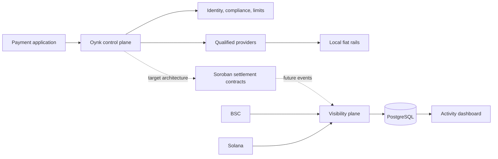

Oynk is building programmable infrastructure that coordinates payment applications, qualified liquidity sources, and local settlement providers across fragmented cross-border routes.

<Warning>
  **Implementation status matters.** This repository currently runs an identity and compliance foundation plus a BSC/Solana settlement-activity visibility plane. The Stellar network and Soroban protocol described in this documentation are the target settlement architecture; no Stellar SDK integration or Soroban contract is present in this repository today.
</Warning>

## What Oynk does

Oynk separates the customer-facing payment experience from the providers and rails that execute each leg. A future control plane will validate requests, obtain quotes, apply corridor and compliance policy, assign providers, and issue an authoritative settlement reference. Settlement assets can then move through a programmable settlement boundary while local partners deliver the destination value.

Today, the implemented platform focuses on visibility and operational foundations:

- Direct indexing of supported BSC and Solana token transfers
- Durable PostgreSQL storage, checkpoints, run records, and failure records
- Public aggregate activity and privacy-safe off-chain transaction reporting
- Business, settlement-partner, and internal identities with organization-scoped roles
- Password, OTP, session, CSRF, email-delivery, and business-compliance foundations

<CardGroup cols={2}>
  <Card title="Understand the system" icon="workflow" href="/concepts/overview">Follow a payment from request to payout and see which layers own each decision.</Card>
  <Card title="Stellar & Soroban" icon="sparkles" href="/stellar-soroban/overview">Read the proposed on-chain settlement and smart-account design, with current gaps clearly labeled.</Card>
  <Card title="Run locally" icon="terminal" href="/get-started/quickstart">Start PostgreSQL, migrate the schema, and run the API, web apps, and docs.</Card>
  <Card title="Operate indexers" icon="activity" href="/infrastructure/indexing">Understand replay safety, confirmations, checkpoints, failures, and metric semantics.</Card>
</CardGroup>

## The holistic model

The solid BSC/Solana visibility path is implemented. The dotted Soroban path is planned and must pass specification, testing, external audit, and deployment review before it can hold or control funds.

## Where to go next

Start with [current status](/get-started/current-status) if you need to know what can be used now. Read [system design](/architecture/system-design) for ownership boundaries, or [Stellar and Soroban](/stellar-soroban/overview) for the proposed protocol.
