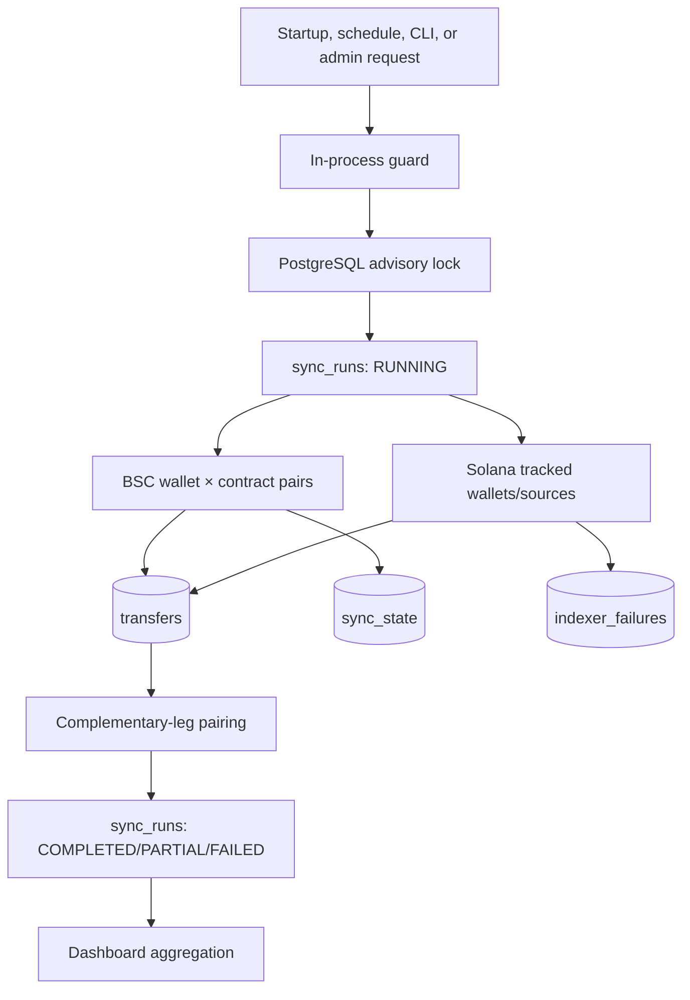

## Coordination

Synchronization begins on API startup when enabled, repeats on a configured interval, runs through `pnpm sync`, or starts asynchronously through the administrator endpoint. An in-process flag avoids duplicate local work; a fixed PostgreSQL advisory lock prevents concurrent processes from running the same global synchronization.

Each run gets a UUID and durable timestamps, status, counts, errors, and successful/failed chains. A partial result is preserved instead of hiding a chain-specific failure.

## Pairing

The current matcher finds confirmed unpaired inflows, chooses an available confirmed outflow by same-asset preference, amount proximity, then time proximity, and writes a bidirectional pair inside one database transaction. The pair is marked heuristic and excluded from authoritative settled-volume reporting.

Future payment records must propagate explicit references into each leg. Only `REFERENCE` pairs should establish business settlement.
