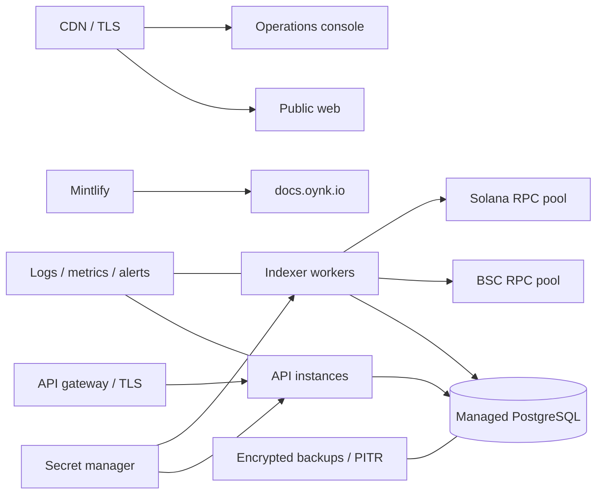

## Recommended topology

Run database migrations as a controlled release step. Use private database networking, separate API/worker credentials, health probes, non-root containers, resource limits, centralized logs, and tested backups. Put operational endpoints behind policy enforcement.

## Mintlify deployment

1. Connect the repository to Mintlify.
2. Set the documentation directory to `apps/docs`.
3. Select the production branch.
4. Verify the preview build and all navigation.
5. Add `docs.oynk.io` in Mintlify's custom-domain setup.
6. Publish the DNS record exactly as Mintlify provides and verify TLS.

The committed `docs.json`, MDX pages, logos, local validator, and relative OpenAPI source are ready for repository-driven deployment. No docs runtime secrets are required.

## Future Stellar deployment

Deploy Soroban contracts per environment only after audit gates. Record network, WASM hash, contract ID, admin/upgrade policy, deployment ledger, and source revision. Verify the deployed bytecode and configure indexers through environment-specific values before enabling any control-plane route.
