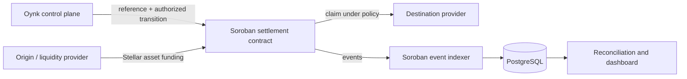

<Warning>
  This section is a design specification and roadmap. Oynk does not currently connect to Stellar, submit Stellar transactions, deploy Soroban contracts, or index Soroban events in this repository.
</Warning>

## Intended role

Stellar is the proposed asset settlement rail. Soroban is the proposed programmable policy boundary that records which settlement request exists, what has been committed, which transitions are permitted, and whether value can be claimed, refunded, cancelled, or disputed.

Oynk would keep customer identity, provider due diligence, quote calculation, route selection, and fiat evidence in the off-chain control plane. The on-chain layer would receive the minimum data and authority needed to enforce settlement state.

## Why this boundary is useful

- One stable reference can connect application, provider, contract, and reconciliation records.
- Funds and state transitions can be constrained by explicit authorization and deadlines.
- Public events can support independent verification without publishing personal data.
- Provider implementations can change without changing the payment application's lifecycle contract.
- Refund and dispute behavior can be specified before value is committed.

## What must be decided before implementation

Network selection, supported Stellar assets and issuers, trustline requirements, contract ownership, upgrade policy, authorization graph, storage model, event schema, fee sponsorship, sequence handling, timebounds, partial funding, dispute authority, emergency pause, recovery, and data retention all remain design decisions.

No RPC URL, issuer, network passphrase, contract ID, or explorer URL should be hardcoded. Every environment must bind configuration to exactly one network and reject cross-network identifiers.
