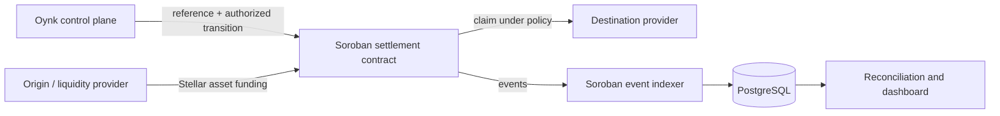

<Warning>
  A separate Oynk settlement-contract MVP is [deployed on Stellar mainnet](https://stellar.expert/explorer/public/contract/CDTDCQ2Y6OASQVJGOFBA2EHP3AV7N6FFULJNEFGMORLYMNHECX7OO2W6). Public candidate source, locked tests, and build/deployment manifests are referenced through the [`settlement-aggregator-protocol`](https://github.com/oynk-io/settlement-aggregator-protocol) submodule. The candidate's generated WASM does not match the historical deployment's on-chain WASM hash, so that deployment remains source-unverified and is not presented as an audited production payment system. Generated application bindings, a submitter, and an event indexer remain unimplemented here.
</Warning>

## Public contract work

The contract workspace is maintained by [Emmanuel Ekoja (`emmanuelekoja`)](https://github.com/emmanuelekoja). Candidate source commit [`60489c3`](https://github.com/oynk-io/settlement-aggregator-protocol/commit/60489c36f9e69aeea54e4075948e5b3e2083d440) builds with the locked toolchain to WASM SHA-256 `d16b5f8a2b9971e2ea45bf0737731ed6348bd83b7c30fde275589f69ea132bc9`. Five SDK invariant tests and two WASM lifecycle tests pass. The machine-readable record is published in [`deployments/candidate.json`](https://github.com/oynk-io/settlement-aggregator-protocol/blob/main/deployments/candidate.json).

## Mainnet MVP evidence

Contract ID: `CDTDCQ2Y6OASQVJGOFBA2EHP3AV7N6FFULJNEFGMORLYMNHECX7OO2W6`

Deployment transaction: `58eb6b55c774aeff2a54b90358fe459bf60f0089113b45caa6f697ef100d2fa0`, recorded on July 11, 2026 at 17:06:19 UTC.

The supplied explorer activity shows three request lifecycles reaching `claim_settlement_asset`:

- Requests 1 and 2 exercised fiat-to-crypto creation, quoting, source-settler acceptance, deposit, source confirmation, and claim with 500 and 1,500 USDC respectively.
- Request 3 exercised a fiat-to-fiat route from country code 840 to 414, including both source and destination settlement confirmation before claim, with 2,360 USDC deposited and claimed.

USDC uses seven decimal places in these contract calls. The raw settlement amounts therefore normalize to 500, 1,500, and 2,360 USDC, totaling **4,360 USDC of settlement principal**. This counts each request once; counting both deposits and claims would produce 8,720 USDC of gross token movement by double-counting the same principal.

This evidence proves that the listed contract calls executed with real USDC on Stellar mainnet. It does not independently prove the underlying fiat transfers, broad customer adoption, or audited production safety.

## Intended role

Stellar is the proposed asset settlement rail. Soroban is the proposed programmable policy boundary that records which settlement request exists, what has been committed, which transitions are permitted, and whether value can be claimed, refunded, cancelled, or disputed.

Oynk would keep customer identity, provider due diligence, quote calculation, route selection, and fiat evidence in the off-chain control plane. The on-chain layer would receive the minimum data and authority needed to enforce settlement state.

## Why this boundary is useful

- One stable reference can connect application, provider, contract, and reconciliation records.
- Funds and state transitions can be constrained by explicit authorization and deadlines.
- Public events can support independent verification without publishing personal data.
- Provider implementations can change without changing the payment application's lifecycle contract.
- Refund and dispute behavior can be specified before value is committed.

## What must be decided before implementation

Network selection, supported Stellar assets and issuers, trustline requirements, contract ownership, upgrade policy, authorization graph, storage model, event schema, fee sponsorship, sequence handling, timebounds, partial funding, dispute authority, emergency pause, recovery, and data retention all remain design decisions.

No RPC URL, issuer, network passphrase, contract ID, or explorer URL should be hardcoded. Every environment must bind configuration to exactly one network and reject cross-network identifiers.
