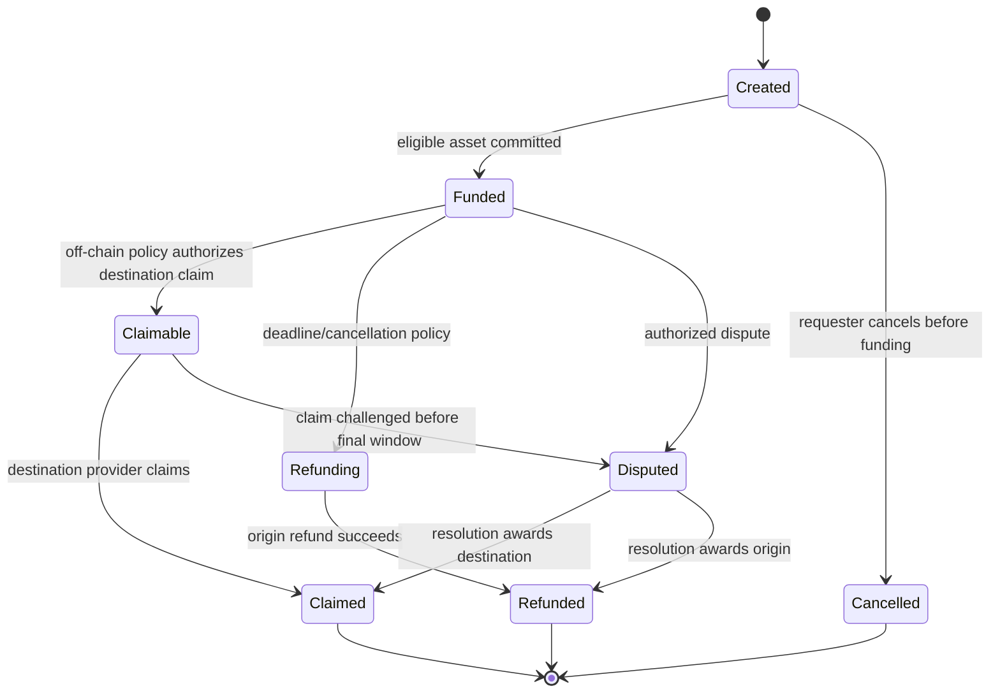

<Warning>No contract implementation or audit exists yet. The structures below are requirements for specification and review, not an ABI.</Warning>

## Proposed state machine

## Minimum settlement record

| Field | Purpose |
| --- | --- |
| `settlement_id` | Stable, non-personal identifier shared with the control plane |
| `asset` and `amount` | Exact Stellar asset and committed integer amount |
| `origin` / `destination` | Authorized account or contract addresses |
| `created_at`, `fund_by`, `claim_by` | Ledger-aware deadlines with explicit semantics |
| `route_commitment` | Hash/reference to versioned off-chain route terms |
| `evidence_commitment` | Optional privacy-preserving commitment to evidence |
| `state` | Current enumerated lifecycle state |
| `authorization policy` | Which principals may fund, authorize, claim, cancel, refund, dispute, or resolve |

## Transition invariants

- A settlement ID is unique and cannot be reused with different terms.
- Funding accepts only the configured asset and exact allowed amount.
- Claim and refund are mutually exclusive terminal outcomes.
- Deadlines are checked against ledger time under documented tolerances.
- Every state transition verifies the necessary Soroban authorization entries.
- Repeated submissions are idempotent or reject without changing value.
- Events contain stable IDs and state, but no names, phone numbers, bank data, or raw compliance evidence.

## Events

The contract should emit versioned events such as settlement created, funded, claim enabled, claimed, refund initiated, refunded, disputed, and resolved. An indexer must store ledger/transaction identity, event position, contract ID, network, event version, payload, and ingestion checkpoint so replay is deterministic.
