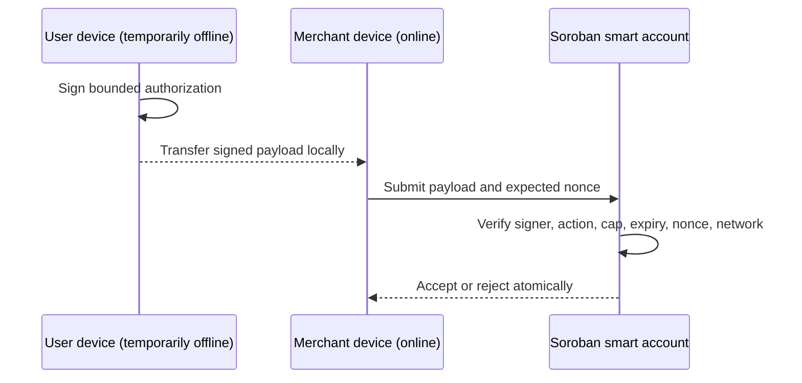

Oynk's planned smart-account layer would let users and applications authorize narrowly scoped operations without giving a broad hot key unlimited authority.

## Authorization model

A policy can combine:

- A Stellar G-account or contract account as the ultimate principal
- Passkey-backed user authorization
- Short-lived session delegates for specific contract functions
- Per-operation, per-asset, per-recipient, and rolling-period spend limits
- Expiry, invocation count, and environment/network constraints
- Nonce or sequence rules that prevent replay
- Recovery and revocation under an explicitly governed policy

Phone numbers may help account discovery or recovery, but they are not cryptographic authorization.

## Low-connectivity payments

This is one-sided low-connectivity operation, not a fully offline settlement guarantee. Merchant connectivity is still required to submit and obtain ledger confirmation. Exposure must be bounded because an offline signer cannot see recent revocation or competing submissions.

## Required safety properties

- Domain separation binds signatures to Oynk, a specific network, contract, action, and schema version.
- Nonces are consumed atomically and cannot be replayed.
- Delegates cannot broaden their own scope.
- Expired or revoked policies fail closed.
- Recovery cannot silently bypass settlement invariants.
- Wallet UX displays asset, amount, recipient, expiry, and effect before signing.
