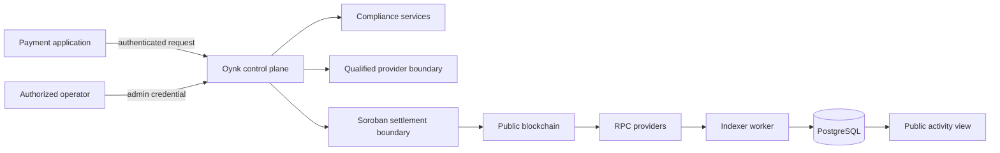
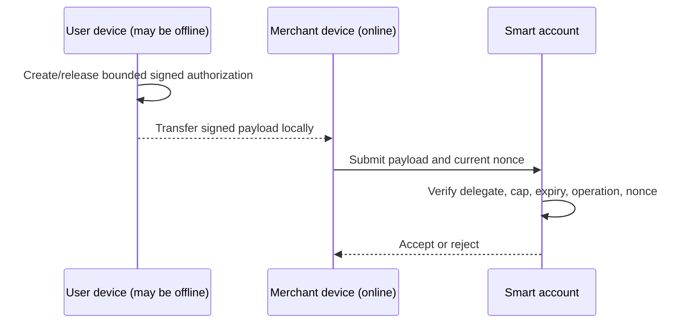
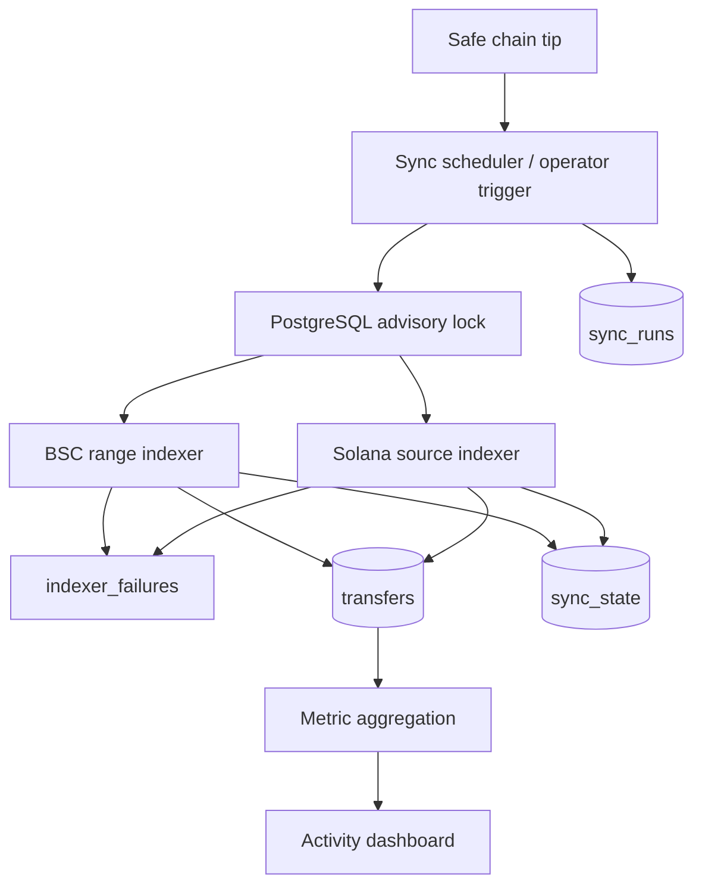
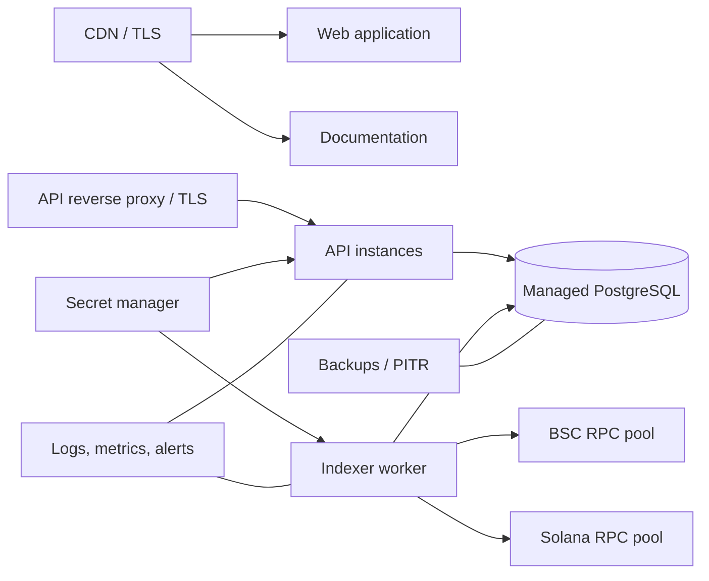
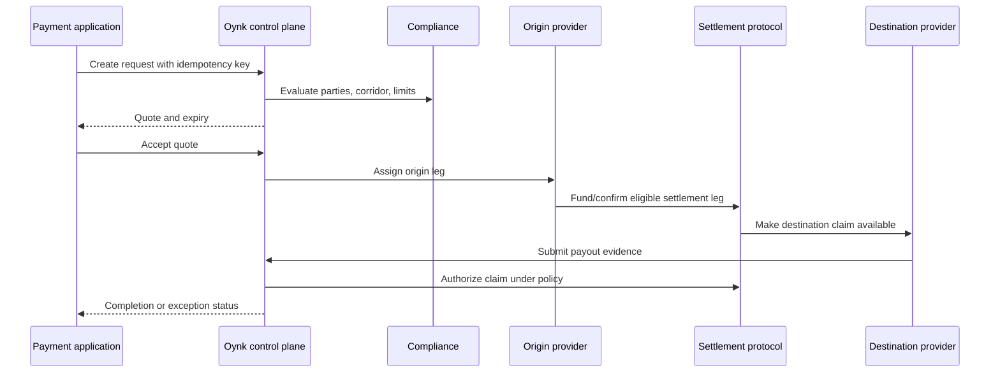

# Oynk full technical architecture

**Architecture status:** Working architecture, August 2026.

This document consolidates Oynk's complete technical architecture into one review surface. Its primary purpose is to specify the SCF Integration Track work: how Privy, Stellar Wallets Kit, Anchor Platform, Blend v2, Stellar USDC, and Oynk's Soroban coordination and settlement protocol combine into one commercial-payment lifecycle. It also covers the implemented monorepo, identity and compliance foundation, BSC and Solana visibility plane, the separately deployed Stellar mainnet settlement MVP, data and API boundaries, and operational controls.

The mainnet MVP completed three settlement lifecycles using real USDC. With seven token decimals, the deposited principals normalize to 500, 1,500, and 2,360 USDC, totaling **4,360 USDC of settlement principal**. This measure counts each request once rather than double-counting its escrow deposit and subsequent claim.

## 1. Executive summary

Oynk is designed as programmable infrastructure between payment demand and local financial capability. Payment applications use a consistent lifecycle while qualified liquidity and settlement providers execute corridor-specific collection, conversion, digital-asset, and payout legs.

The architecture separates five concerns:

1. **Experience:** public web, payment experiences, and organization-specific operations consoles.
2. **Control plane:** identity, authorization, exact-value validation, compliance policy, quotes, provider selection, payment state, and authoritative references.
3. **Provider plane:** qualified participants that supply liquidity, banking connectivity, collection, exchange, and destination payout.
4. **Settlement plane:** the deployed Soroban MVP and its proposed hardened successor governing funding, commitments, claims, refunds, and disputes.
5. **Visibility plane:** chain indexers, normalized PostgreSQL records, reconciliation, metrics, and operational dashboards.

The design deliberately separates observed blockchain movement from verified business settlement. A chain transaction proves accepted ledger activity; it does not prove customer authorization, provider eligibility, fiat delivery, or end-to-end payment completion.

## 2. System goals

- Durable and replay-safe observation of supported settlement assets.
- Clear separation of blockchain movement from estimated business settlement.
- Modular provider and corridor integration boundaries.
- Least-privilege administration and observable synchronization.
- Exact value handling and explicit valuation assumptions.
- A path to passkey-authorized smart accounts and Soroban settlement controls.

## 3. Non-goals

Oynk does not replace local licensing, sanctions controls, banking connectivity, provider due diligence, liquidity commitments, or dispute operations. The indexed activity dashboard is not proof that every chain transfer is an Oynk settlement.

## 4. Actors

Payment applications originate requests. Origin and destination settlement providers perform assigned fiat and digital-asset legs. Liquidity providers quote or supply settlement assets. Compliance providers perform identity and transaction screening. Operators administer providers and investigate exceptions. Recipients receive destination value. Blockchain validators and RPC providers are external trust dependencies.

## 5. Trust boundaries

Credentials, provider evidence, personal data, database access, chain authorization, and public reporting cross distinct boundaries and require independent policies.

## 6. Control plane

The proposed control plane owns payment requests, quotes, rate-lock expiry, eligibility, provider assignment, limits, compliance decisions, and lifecycle state. It must be authoritative for settlement references. Blockchain indexers must never infer authorization or payment completion.

## 7. Data plane

The data plane carries fiat instructions through licensed/local partners and digital assets through supported chains. Implemented data-plane observation covers USDT, USDC, and BTCB on BSC and USDT/USDC on Solana. BTCB uses a fixed operational estimate of USD 25,000 per BTCB; this is not historical pricing.

## 8. Smart-account layer

Planned smart accounts may combine passkeys, Stellar G-account authorization, EVM authorization, bounded session delegates, spend limits, expiry, run limits, and recovery policy. Phone numbers may aid discovery or recovery but are not cryptographic authentication. Every state-changing action must ultimately be authorized by keys under an explicit policy.

## 9. Settlement-contract layer

The deployed Soroban MVP records settlement requests, routes, settler assignments, escrowed settlement assets, deadlines, evidence hashes, claims, cancellations, refunds, and disputes. Explorer activity shows three requests reaching an on-chain claim: two fiat-to-crypto flows and one fiat-to-fiat flow. Using USDC's seven decimals, their escrow principals normalize to 500, 1,500, and 2,360 USDC, totaling 4,360 USDC of real settlement principal. The current live WASM matches the public artifact built from source commit `60489c3`; upload, upgrade, and post-upgrade verification evidence is recorded through the `settlement-aggregator-protocol` submodule. Generated bindings and the event indexer are not yet integrated. Further hardening still requires explicit specifications, broader invariant and adversarial testing, independent security review, and controlled production release gates.

## 10. Provider network

Providers are modular participants with KYB status, corridor eligibility, asset and fiat capabilities, limits, collateral rules, performance history, suspension state, and exit procedures. A common settlement interface reduces bespoke application integration, but each corridor still depends on law, compliance, liquidity, banking connectivity, and operational reliability.

## 11. Fiat integrations

Fiat connectors should expose idempotent create, status, evidence, cancel, and reconciliation operations. Provider-specific details remain behind adapters. Fiat confirmation is external evidence and must not be inferred from an on-chain transfer alone.

## 12. Blockchain integrations

BSC indexing uses contract-specific ERC-20 logs, wallet/contract cursors, safe-tip confirmation depth, rewind, adaptive ranges, cached block timestamps, and deterministic identities. Solana indexing uses owner/source signatures and parsed token balances. Production Solana support still needs bounded historical pagination, complete source discovery, Token-2022 coverage, and retry processing.

## 13. Offline authorization

This is one-sided low-connectivity operation, not fully offline payment. Risks include double-spend attempts, stale revocation, replay, device compromise, nonce races, and merchant connectivity loss. Policies require narrow caps, short expiry, secure key storage, nonce/replay controls, and explicit maximum exposure.

## 14. Rate locks

Quotes require an identifier, provider commitment, asset/fiat amounts, expiry, allowed slippage, funding conditions, partial-funding policy, cancellation behavior, and limits. Expired or underfunded quotes must not silently settle at stale rates.

## 15. Indexing and analytics

Gross transfer volume is the sum of indexed legs. Estimated settlement uses only reference-paired legs and the conservative smaller value. Heuristic similarity is non-authoritative. Last indexed time comes from sync runs, not transaction time.

## 16. Data model

Core implemented tables are `tracked_wallets`, `transfers`, `sync_state`, `sync_runs`, `indexer_failures`, and `tracked_solana_sources`. Transfer reference/pairing columns allow future control-plane identifiers and distinguish `REFERENCE` from `HEURISTIC` pairing.

## 17. API boundaries

The public dashboard is read-only. Manual sync is an administrator operation. Liveness shows process availability; readiness checks configuration and database access. Operator run/failure endpoints require a deployment access policy. Future payment APIs require authentication, idempotency keys, input schemas, authorization, rate limits, and auditable state transitions.

## 18. Security

Controls include exact input validation, key-based authorization, least privilege, replay-safe identities, confirmation depth, reorg replay, administrative credentials, advisory locks, secret redaction, and durable failures. Before production: rotate secrets, narrow CORS, add security headers, separate operator roles, audit contracts, add RPC failover, instrument anomaly alerts, and test restoration.

## 19. Compliance integration points

KYC/KYB, sanctions screening, transaction monitoring, provider tiers, corridor policy, limits, evidence retention, case management, and Travel Rule exchange where applicable belong at control-plane gates. The architecture does not imply licenses or approval.

## 20. Scalability

Move indexing into workers partitioned by chain/source under leases; batch database writes; retain deterministic uniqueness; use server-side pagination; monitor query plans; and add daily aggregates only when measured load justifies them.

## 21. Reliability

Safe replay, confirmation depth, rewind, idempotent writes, durable run/failure state, advisory locking, bounded retries, and partial-result reporting are baseline controls. Remaining work is atomic page commits, persistent BSC range preferences, Solana historical checkpoints, retry workers, and redundant RPC providers.

## 22. Observability

Every sync should emit run ID, chain, source, range/page, attempts, reductions, inserts, cursor changes, lag, duration, and classified errors without credentials. Metrics and alerts should cover stalled cursors, failure backlog, repeated reorg replay, RPC latency/rate limits, database saturation, partial runs, and stale readiness.

## 23. Disaster recovery

Use encrypted PostgreSQL backups and point-in-time recovery, store migration history, document RPO/RTO, test restoration, preserve provider/control-plane records, and rebuild derived chain data from cursors or bounded backfills. Never treat RPC archival availability as the only backup.

## 24. Deployment

API, worker, web, and docs should deploy independently. Use HTTPS, a secret manager, restricted database networking, non-root containers, migration jobs, health probes, resource limits, centralized logs, and tested backups.

## 25. Testing strategy

Unit-test normalization, cursor keys, range adaptation, rewind, deterministic identities, decimal arithmetic, and metric semantics. Add chain fixtures for logs and parsed Solana transactions. Integration-test migrations, atomic cursor behavior, duplicates, authorization, advisory locks, readiness failure, partial runs, and retries against PostgreSQL. Run staging backfills against archival RPCs before production.

## 26. Current limitations

- A Soroban settlement MVP exists on mainnet, and its current live WASM matches the public source artifact referenced through the submodule; generated bindings, the event indexer, payment orchestration, smart accounts, provider registry, and compliance adapters remain absent here.
- Solana historical pagination/retry execution and Token-2022/source coverage are incomplete.
- Chain lag is not yet surfaced from live safe tips.
- Heuristic legacy pairing is not authoritative.
- Automated coverage and production telemetry are insufficient for production readiness.

## 27. Milestones

1. Complete and test indexer reliability and operator controls.
2. Specify, harden, independently review, and reproducibly deploy the next Soroban settlement contract; specify smart accounts separately.
3. Implement authenticated control-plane lifecycle, references, compliance gates, and provider sandbox.
4. Pilot limited corridors with qualified providers and explicit operational limits.
5. Add independent security review, recovery drills, monitoring, and controlled production rollout.

## 28. Production-readiness checklist

- [ ] All critical audit findings closed and independently reviewed.
- [ ] Solana bounded backfill and failure reprocessor deployed.
- [ ] PostgreSQL migrations, backups, PITR, and restore drill verified.
- [ ] Primary and secondary archival RPC providers tested.
- [ ] Operator access, rotation, audit trail, CORS, and rate limits deployed.
- [ ] Contract and smart-account specifications audited before funds are exposed.
- [ ] Compliance and corridor policies approved for each launch market.
- [ ] End-to-end idempotency, reorg, outage, duplicate, and dispute tests pass.
- [ ] Dashboards and alerts cover lag, failures, partial runs, RPCs, and database health.
- [ ] Runbooks, incident ownership, rollback, and customer communications are rehearsed.

## Payment lifecycle reference

