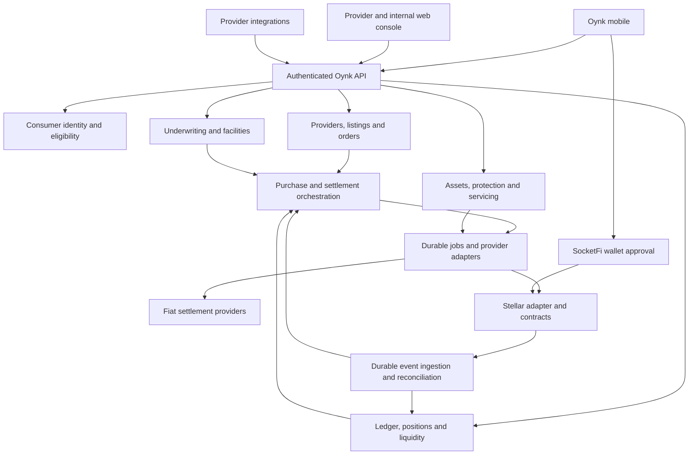

# Oynk mobile and provider network implementation plan

Date: 2026-09-13. Status: proposed implementation, not shipped functionality.

Baseline: [cross-repository implementation audit](mobile-codebase-audit-2026-09-13.md).

## Product outcome

Build Oynk as the customer experience and orchestration layer connecting capital, asset purchases, financing, settlement and ongoing ownership obligations. Providers deliver the specialized real-world services. A purchase should remain visible through repayment and release of the financing obligation, including insurance, inspections, maintenance, disputes and recovery where applicable.

The main journey is:

**Fund account → allocate capital → browse verified assets → select own contribution → request facility → review complete costs and obligations → approve → settle seller → verify delivery and asset record → repay and service asset → close facility.**

Initial planning assumptions: Oynk branding; the existing React Native app; Stellar USDC as the candidate settlement asset; Nigeria/NGN and vehicles as the first controlled marketplace pilot; manually reviewed financing and a small approved provider cohort. These are scope proposals inferred from the examples, not confirmed market availability or approved product terms. Build currency/category configuration so subsequent markets and assets do not require a redesign.

## Product boundaries and pilot scope

| Release | Customer outcome | Supporting operations |
| --- | --- | --- |
| Foundation | Sign in, recover account, complete profile/verification, see authoritative wallet activity | Identity binding, secure sessions, reconciliation, customer support |
| Capital and settlement beta | Deposit/withdraw through an eligible route; understand available versus committed capital | Ledger, provider quotes, limits, verified funding, failure/refund handling |
| Vehicle ownership pilot | Buy a verified vehicle with own capital plus approved pool facility | Listings, underwriting, two-source funding, verified settlement, delivery, insurance, inspection, repayment and exception handling |
| Expansion | More asset classes and providers, richer capital products | Property/equipment/solar/inventory policies, automated underwriting, integrations, competitive routing |

The vehicle pilot is not complete at checkout. It must include the first repayment, an inspection booking/report, an insurance lapse or renewal path, a failed settlement/refund exercise and facility closure. A customer may buy entirely with available own capital; pool financing must remain an explicit request, not an assumed entitlement.

Property development milestone payouts, multi-currency borrowing, joint borrowing, revolving inventory facilities, permissionless provider staking, transferable RWA tokens, automatic recovery and sophisticated yield strategies are later scope. Data models should allow extension without presenting these as available products.

## Target architecture

Use a modular backend within the existing platform initially. Keep financial transitions transactional in PostgreSQL and use durable workers/outbox processing for external effects. Separate services operationally only when scale or isolation requires it.



The mobile app displays server-authorized balances and transitions. It cannot approve financing, confirm fiat payout, mark repayment settled, certify inspection, or release collateral. Provider attestations require verification and authorization before they cause financial effects.

### Responsibilities by repository

| Repository | Changes |
| --- | --- |
| `oynk-mobile-app` | Oynk identity/configuration; feature-based navigation; secure auth adapter; typed API; customer capital, marketplace, facility and servicing screens |
| `oynk-platform/apps/api` | Consumer sessions; ledger; providers; catalog; credit; orders; settlement; assets; servicing; documents; notifications; reconciliation |
| `oynk-platform/apps/console` | Capability-based provider workspace and real internal review/operational queues |
| `oynk-platform/packages/shared` | New versioned financial and product contracts; retain existing dashboard DTOs separately |
| `oynk-platform/apps/docs` | Document only delivered endpoints and their availability; update OpenAPI mirror together |
| `settlement-aggregator-protocol` | Aligned client bindings, assignment authorization, new capital/purchase contracts where required, invariant/lifecycle tests |

Keep the mobile repository separate initially. Share a versioned API client/contract package through a reproducible package artifact or registry; avoid runtime sibling-relative imports. Do not couple mobile releases to web React versions.

## Provider as a core domain primitive

An **Oynk Provider** is a verified participant supplying assets, settlement, liquidity, verification, protection, maintenance, servicing or recovery needed for Oynk transactions.

A provider links to an existing organization and can have multiple independently approved capabilities. Capability is separate from staff permission, provider status and public trust tier.

| Capability | Scope and configuration | Deliverable |
| --- | --- | --- |
| ASSET | Categories, inventory locations, settlement currencies, title/document requirements | Listing, invoice, reservation, delivery evidence |
| SETTLEMENT | Currency pairs, networks/assets, bank rails, hours, limits, capacity, quote lifetime | Funding/payout execution and verifiable references |
| VERIFICATION / VALUATION | Asset classes, territories, certification, independence requirements | Signed verification or valuation report |
| PROTECTION | Products, coverage territory, underwriting conditions | Bound policy, coverage dates, renewal and claim status |
| MAINTENANCE / SERVICE | Garage locations, supported assets, inspection/repair offerings, appointment capacity | Inspection report, mileage, condition, evidence and invoice |
| SERVICING / RECOVERY | Assigned facility scope, permitted case actions, escalation rules | Case milestones and reviewed recovery outcomes |

Lifecycle: application → submitted → under review → approved → active; include information requests, rejection, capability expiry, suspension and orderly exit. A registered provider need not have an active transaction capability. Operational selection requires active organization, active capability, jurisdiction eligibility and current limits.

Public tiers: **Oynk Provider**, **Oynk Verified**, **Oynk Preferred**. Define evidence and expiration rules for each. “Preferred” requires verified performance and any negotiated pricing; it must not imply guaranteed asset quality or override capability suspension.

Introduce `provider_assignments`: order/facility/asset + capability + provider + task + status + SLA + evidence requirements. This captures a dealer, independent verifier, insurer, settlement provider and garage serving the same vehicle without making them one seller entity. Provider replacement preserves old assignments and evidence, creates a new assignment and notifies affected customers.

Extend the existing partner console to providers using capability-based sections. Preserve SETTLEMENT_PARTNER identity compatibility during migration; do not force asset dealers into settlement-specific schemas or convert existing organizations destructively.

## Mobile experience

Use five primary destinations: **Home, Capital, Marketplace, My Assets, Activity**. Profile/security/support are accessible from the account control. Navigation availability is returned by the server according to release mode and customer eligibility.

| Area | Screens and required states |
| --- | --- |
| Onboarding | Welcome, wallet authentication, Oynk profile, eligibility/KYC, verification pending/needs information/approved, recovery |
| Home | Available balance, capital allocation, next obligation, pending transaction, inspection/insurance reminders |
| Capital | Wallet funds, pool position, allocations, deposit/withdraw, route quote, receipt, queued redemption, statements |
| Marketplace | Categories, search/filter, listing details/media/docs summary, provider profile, availability and reservation expiry |
| Purchase | Own contribution input, facility estimate, application status, offer, complete cost review, consent/approval, funding and delivery timeline |
| My Assets | Vehicle/property detail, facility balance, payment schedule, insurance, inspections, appointments, service history, documents, support case, closure |
| Activity | Account-scoped transactions and obligations, pending/settled/failed/reversed states, receipts and detail links |
| Account | Profile, security/devices, bank beneficiaries, notification settings, consents, help and account closure request |

A listing's “Your balance” must distinguish spendable funds from invested or restricted capital. The contribution control cannot spend a pool position that is still awaiting redemption. Display the pool facility as requested/approved/reserved separately from customer-owned funds.

For the user's 18,500 USDC example: with 10,200 USDC spendable and a 9,250 USDC contribution, the asset-price remainder is 9,250 USDC and 950 USDC remains before any separately disclosed charges. Insurance, settlement, registration and service charges may alter cash due or financed amount. Show those components and request new consent when price or quote changes. Do not invent a repayment estimate until a versioned offer and term policy exist.

Every asynchronous screen supports loading, empty, failure, offline/stale data, pending review and retry. Poll active operations with bounded backoff and refresh on app foreground. Push messages prompt a server refresh; they are not confirmation of funds. Offline access can show timestamped cached data; an ambiguous financial submission must be reconciled by operation ID before any resubmission.

### Mobile code structure

```text
src/
  app/                 configuration, bootstrap, navigation, providers
  features/
    auth/ profile/ capital/ marketplace/ checkout/
    facilities/ assets/ servicing/ activity/ support/
  components/          shared UI primitives and feedback states
  services/            api client, socketfi adapter, secure session, notifications
  contracts/           generated/versioned API contracts
  utils/               exact amount formatting, dates, validation
```

Keep Zustand for local UI state and an intentionally small session projection. Use a dedicated server-data cache with account-scoped invalidation; library selection follows a compatibility check. Extend existing React Navigation instead of introducing a second navigator. Reuse brand tokens from the platform, but implement native-accessible components rather than copying DOM code.

## Identity and wallet integration

1. Wrap the supplied SocketFi SDK behind an adapter. Verify hosted auth response shape, cancellation, deep links, recovery, supported network, transaction approval and error behavior on both native platforms.
2. Add external identities keyed by issuer and subject, and wallet bindings keyed by chain/network/address. Never merge accounts based only on matching email or accept a client-submitted wallet as proof of ownership.
3. Backend validates SocketFi credentials with a documented verification mechanism. If introspection or signed claims are unavailable, complete a provider-supported proof flow before issuing Oynk sessions. This is a required integration discovery item; no verifier is present locally.
4. Issue short-lived native access credentials and rotating/revocable refresh sessions. Retain browser cookie/CSRF authentication for the console. Adapt the mandatory password column to support external-only identities without dummy passwords.
5. Store native secrets using platform secure storage, redact logs, clear all account-scoped caches on logout/account change, and test recovery after reinstall. Expo SecureStore documents platform-specific persistence and backup behavior; it should not be the sole store of irreplaceable wallet information. [Expo SecureStore](https://docs.expo.dev/versions/v54.0.0/sdk/securestore/).
6. Oynk profile/eligibility is distinct from successful wallet login. Transaction approval is distinct from login and must bind the exact asset, amount, recipient, network, quote, expiry and permitted call.

Use native development builds for authentication/deep-link/device testing; Expo documents their support for an application's own native runtime. Keep the existing SDK baseline until the integration works, then assess an upgrade separately. [Expo development builds](https://docs.expo.dev/develop/development-builds/introduction/).

## Capital and accounting design

Implement immutable double-entry journals with balancing enforced per asset/currency, exact integer/decimal arithmetic, unique external references, reversal entries, and transactionally reserved funds. Amount APIs carry strings plus asset/network/precision, not JavaScript numbers. Never assume all tokens have six decimals; obtain precision from verified asset configuration.

Represent these separately:

| Concept | Meaning |
| --- | --- |
| Wallet balance | Confirmed wallet funds; if self-custodied, availability also depends on current chain state and signing |
| Pool position | User's claim/shares in a defined capital product, with valuation timestamp and redemption terms |
| Available capital | Funds actually eligible for the requested use after holds/restrictions |
| Purchase reservation | Customer contribution reserved for a specific expiring order |
| Pool commitment | Liquidity reserved against an approved facility |
| Facility principal | Amount actually disbursed and still owed |
| Provider payable | Amount owed for delivered/approved provider work |
| Fees and protection charges | Contracted line items with recipient, timing, currency and cancellation/refund rule |

A pool position is not automatically liquid USDC. For the initial design, consuming a position means an explicit eligible redemption into spendable funds. A model in which capital remains invested and is pledged as collateral is a different product and must have separate lock, valuation and liquidation rules.

Define pool contributions, units/ownership claims, valuation, idle liquidity, reserve floor, committed funds, outstanding receivables, impairment/loss allocation, withdrawal queues and distribution rules before offering pool positions. Ledger projections must reconcile to actual custody/vault assets and liabilities. Yield is displayed only when its source, accrual, realized distribution and losses are represented; no fixed yield is assumed by this plan.

Required invariants: balanced journal per asset; no double spending of held funds; no facility disbursement above approval; no provider payout above reserved allocation; no duplicate posting on webhook/event replay; no principal repayment above outstanding principal; losses and recoveries cannot silently manufacture liquidity.

## Financing, checkout and settlement

### Separate state machines

| Resource | Main states and exceptions |
| --- | --- |
| Listing | Draft → review → active → reserved → sold; withdrawn/expired |
| Credit application | Draft → submitted → under review → approved/declined/needs information; offer expired/withdrawn |
| Facility | Offered → accepted → funding pending → active → repaid → closed; cancelled before disbursement, overdue, hardship, default, recovery |
| Purchase | Draft → priced → reserved → authorized → funding pending → funded → settlement pending → seller paid → delivery pending → completed; cancelled/expired/disputed/refund pending/refunded |
| Settlement | Quoted → accepted → funded → executing → evidence pending → confirmed → completed; expired/failed/unknown/disputed/refunded |
| Obligation | Scheduled → due → partially paid → paid; overdue/waived/reversed |
| Service task | Required → booked → attended → report submitted → verified → complete; missed/rejected/rescheduled |

Map settlement states to the existing contract's actual enum and transitions through an adapter; these product states are not a proposed silent change to its ABI. Keep settlement completion separate from asset delivery and facility closure.

### Purchase orchestration

1. Verify buyer eligibility, active seller capability, listing/asset verification, inventory and price version.
2. Produce a priced order with seller currency, own contribution, requested principal and all mandatory charges. Facility underwriting considers customer evidence, affordability policy, asset valuation, exposure, liquidity and required provider coverage. Start with a real manual review queue.
3. Present a time-limited approved offer, complete repayment schedule and provider obligations. Persist consent and immutable versions of terms, price, fees, coverage and route quote.
4. Atomically reserve listing, customer funds and pool capacity. Underwriting approval alone does not guarantee available pool liquidity.
5. Collect/lock both funding contributions using a deliberately designed purchase escrow or custody workflow. Chain and bank effects are not one PostgreSQL transaction: use durable orchestration, explicit pending states and compensating releases/refunds.
6. If the seller accepts USDC, use a separately specified direct-transfer/purchase-escrow path. The current contract has no crypto-to-crypto purchase flow. If the seller requires NGN, execute a verified settlement-provider route bound to the approved beneficiary and order.
7. Verify payment evidence before confirming seller settlement. Unknown bank timeouts go to reconciliation; do not reroute a possibly completed payout. Complete physical delivery/title checks separately.
8. Create or activate the asset record and servicing assignments; activate repayment accrual at the contractually agreed trigger, such as disbursement, rather than a convenient UI state.
9. On cancellation or refund, reconcile actual returned funds and fee refundability, reverse facility principal as appropriate, and return funds to their original sources. Post-payment disputes need bank/provider and purchase-case handling, even if chain escrow is already complete.

Existing crypto-to-fiat escrow takes the full amount from the request creator. It cannot be treated as an atomic buyer-plus-pool funder. Before financial implementation, choose and document custody/signing responsibility. Preferred target for the pooled product is explicit vault and purchase escrow contracts plus an off-chain accounting mirror; a centrally managed pilot would require its own approved custody controls and must not be described as noncustodial.

### Settlement routing

Eligibility filtering precedes pricing: active capability, corridor, correct asset/network, verified payout method, available capacity, operating hours, amount limits and required SLA. Compare firm quotes by net beneficiary amount/total source cost, disclosed fees, expiry, capacity, speed, reliability and concentration. Store why the route was chosen and reserve its capacity. Begin with one working adapter plus a second simulated adapter for failure tests; add real competitive routing when multiple providers are integrated.

For NGN deposits, issue unique funding instructions/reference, verify source receipt, execute the fiat-to-USDC route and credit only the reconciled destination. Quotes and screenshots are not deposit confirmation. Handle late, partial, excess, duplicate and unmatched payments explicitly.

## Asset lifecycle, repayment and provider services

Create an asset record containing category, serial/VIN/title references, buyer, seller, verified valuation, purchase/settlement references, facility, documents, condition history and provider assignments. Keep private files in authorized object storage; store integrity hashes/version references where appropriate. A digital asset record does not itself establish legal title or require minting a transferable token.

Asset policy templates control required providers and tasks. Vehicle templates include insurance plus certified inspection/maintenance; property templates include title/valuation and property insurance/inspection; equipment and solar templates can add warranty and servicing; inventory/receivable finance will need distinct monitoring and repayment rules.

The monthly obligation is itemized as **principal + financing charge + insurance/protection + scheduled service/inspection + other agreed charges**. Each item records recipient, currency, due date, calculation basis, and whether it is one-time, recurring or usage-based. Do not hardcode a universal $100 or monthly garage visit; support monthly inspection as a selectable vehicle policy and apply the agreed policy to each facility.

Repayment requires payment intents, allocation order, partial/late payment, rounding rules, grace periods, early payoff, overpayment refunds, failed mandates and receipts. Scheduled debits require a real supported mandate/authorization; otherwise provide a due reminder and customer-approved payment. FX treatment for NGN repayment against USDC debt must be explicit at quote/acceptance time.

Garage workflow: customer selects an eligible location/slot → garage accepts → identity/vehicle match → inspection captures mileage, checklist, photos and findings → authorized report submission → review/verification → task completion and provider fee settlement. Reject duplicated reports and implausible readings for review; distinguish inspection from repair approval. A repair quote requires its own consent and payer allocation.

Insurance workflow: quote → accepted/bound coverage → active policy → renewal reminders → renewed/expired/cancelled → claims. Financed assets must display coverage gaps and create a servicing case. Missed inspection, asset damage and insurance lapse create defined escalation tasks; they do not automatically authorize repossession.

Facility closure reconciles all principal and applicable charges, resolves open cases, releases collateral restrictions according to the agreed process, supplies closure documents and records the asset ownership/status update. Recovery needs restricted case access and human authorization; repayment status must remain visible throughout disputes.

## Proposed schema and API contracts

All entries below are new work. Add forward-only migrations; do not rewrite the existing migration history.

| Domain | Main records |
| --- | --- |
| Consumer identity | `consumer_profiles`, `external_identities`, `wallet_bindings`, `mobile_sessions`, `verification_cases`, `consents` |
| Accounting/capital | `ledger_accounts`, `journal_entries`, `journal_lines`, `balance_holds`, `capital_products`, `capital_positions`, `pool_commitments`, `redemption_requests` |
| Providers | `providers`, `provider_capabilities`, `provider_locations`, `provider_approvals`, `provider_limits`, `provider_assignments`, `provider_credentials` |
| Catalog/purchase | `listings`, `listing_versions`, `inventory_reservations`, `purchase_orders`, `order_allocations`, `order_events` |
| Credit | `credit_applications`, `underwriting_decisions`, `facility_offers`, `facilities`, `repayment_schedules`, `obligations`, `repayment_allocations` |
| Settlement | `settlement_quotes`, `settlement_orders`, `settlement_legs`, `beneficiaries`, `provider_evidence`, `chain_transactions`, `chain_events`, `reconciliation_cases` |
| Lifecycle | `assets`, `asset_verifications`, `asset_documents`, `protection_policies`, `service_plans`, `appointments`, `inspection_reports`, `servicing_cases` |
| Reliability | `idempotency_records`, `outbox_events`, `webhook_receipts`, `job_attempts`, `notification_deliveries` |

Prefer typed relational columns for financial amounts, ownership and lifecycle states. Versioned JSON schemas can hold category-specific inspection fields. Apply user/organization/assignment scope, foreign keys, unique external IDs, audit actor, timestamps and optimistic concurrency versions.

| Proposed prefix | Operations |
| --- | --- |
| `/api/v1/mobile/auth` | External identity exchange, refresh, revoke |
| `/api/v1/me` | Profile, eligibility, consents, wallets, capabilities |
| `/api/v1/capital` | Balances/positions, deposit intents, withdrawal/redemption requests, statements |
| `/api/v1/marketplace` | Listings, listing detail, public provider summaries |
| `/api/v1/purchases` | Price/estimate, reserve, authorize, status, cancel, delivery issue |
| `/api/v1/facilities` | Application, offer, acceptance, schedule, repayment intent, payoff quote |
| `/api/v1/settlements` | Quote, accept, operation status and receipt |
| `/api/v1/assets` | Asset detail, coverage, service requirements, bookings, documents |
| `/api/v1/activity` | Cursor-paginated customer history |
| `/api/v1/provider` | Capability application, listings, assignments, quotes, reports and evidence |
| `/api/v1/internal` | Review decisions, provider activation, underwriting, reconciliation and servicing queues |

Financial mutations require an idempotency key scoped to principal and endpoint, payload hash comparison, persisted response/operation ID and concurrency protection. Responses use typed errors, request ID, amounts as strings, UTC timestamps, quote/offer expiry and version. Signed webhooks use replay protection and deduplication. Provider secrets stay server-side. Document access is short-lived, authorized, audited and scoped to the assignment.

## Contract and chain work

1. Build/validate a TypeScript interface against the active settlement ABI; replace the legacy contract map and raw-Keypair mobile assumption. Verify integer boundaries and network configuration.
2. Implement submission/simulation/status tracking and persistent Stellar events with unique network/contract/event identity, cursors, replay handling and recovery. RPC event history is bounded; inspect the actual node retention window and maintain durable ingestion/backfill. [Stellar getEvents](https://developers.stellar.org/docs/data/apis/rpc/api-reference/methods/getEvents).
3. Enforce provider assignment authorization in contract logic or a reviewed authorization mechanism. The current `accept_settlement` does not restrict callers to an approved provider registry; application-only restrictions are insufficient.
4. Specify capital vault/purchase escrow interfaces independently from settlement: deposit/redeem/reserve/release, approved disbursement, contribution/refund ownership, principal repayment and loss treatment. Do not activate the draft treasury/registry merely because their folders exist.
5. Test composition with SocketFi account authorization, provider signers and manager permissions, including all three existing settlement modes and the separate direct-USDC purchase path.
6. Add storage TTL/restore operations, custody/manager/admin access controls, upgrade compatibility and monitoring appropriate to the selected contract architecture. Never deploy/upgrade an existing live contract as a side effect of mobile development.

## Delivery sequence and acceptance gates

Work streams may proceed concurrently once their contracts are fixed, but each dependent release requires its gate. Effort below is a planning estimate in elapsed weeks for a staffed team, not a delivery commitment; integrations and contract review are explicit external dependencies.

| Phase | Scope and primary owners | Dependency | Exit evidence | Rough effort |
| --- | --- | --- | --- | --- |
| 0 — Repair and specification | Mobile/backend/product: repair prototype, align SDK contract, define money/custody/pilot rules, publish API contracts | Current audit | Typecheck clean; native auth proof; architecture decisions recorded; reproducible package setup | 1–2 weeks |
| 1 — Identity and mobile foundation | Mobile/backend: external identity verification, native sessions, profile/KYC, app structure and API errors | Phase 0 | iOS/Android login/recovery/logout; cross-account isolation; protected API and expiry tests | 2–3 weeks |
| 2 — Ledger and providers | Backend/console/protocol: journal/holds, provider capability review, documents, chain bindings and event ingestion | Phase 1 identity contract | Balanced/replay/concurrency tests; provider activation/suspension; reconciled staging wallet event | 3–5 weeks |
| 3 — Capital and fiat routes | Backend/mobile/protocol: selected pool/vault model, positions/redemptions, deposit/withdraw and settlement adapter | Phase 2 plus custody/asset policy | Confirmed deposit; failed payout recovery; refund; liquidity/withdrawal queue; no duplicate credit | 3–5 weeks |
| 4 — Catalog and financing | Mobile/backend/console: vehicle listings, reservations, underwriting, offer/schedule/cost disclosure | Phase 2; final funding contract from Phase 3 | Dealer lists; eligible customer applies; reviewer decisions; inventory race and affordability/limit checks | 3–4 weeks |
| 5 — Purchase and servicing | All: dual-source funding, seller payout, delivery, RWA record, insurance, garage, repayments and closure | Phases 3–4 | Full vehicle journey and all failure/compensation scenarios below | 4–6 weeks |
| 6 — Controlled release | QA/operations/security/mobile: device coverage, monitoring, backup/recovery, support drills, store distribution | All pilot gates | Capped participant pilot, reconciled reports, incident owners and release sign-off | 2–3 weeks |

These phases total roughly 18–28 weeks if executed sequentially. A product/design lead, two backend engineers, one or two mobile engineers, a contract engineer, QA and provider operations can overlap some work. Re-estimate after Phase 0; provider readiness and contract/custody decisions may dominate the critical path. A clickable prototype is an earlier design deliverable and should be labeled as such.

### First implementation sprint

| Ticket | Concrete change | Done when |
| --- | --- | --- |
| MOB-001 | Resolve duplicate login source policy, add Button disabled/loading behavior, implement wallet clipboard operation | Existing typecheck passes and affected native actions work |
| MOB-002 | Replace RonPay/CG Pay configuration with Oynk app/environment settings; select one lockfile; update README | Identifiers, redirect registration and reproducible install agree |
| MOB-003 | Build SocketFi adapter with validated session shape and redacted diagnostics | Staging authentication/cancel/reopen/transaction approval works on both OSes |
| API-001 | Specify consumer external identity and native session schema/routes | Reviewed contracts cover issuer verification, ownership and account linking/recovery |
| MOB-004 | Add typed API boundary and account-scoped session/cache reset | Expired/invalid sessions fail closed and user switching leaks no data |
| DOM-001 | Define Amount, ProviderCapability, CapitalPosition, Offer and Purchase contracts | Backend/mobile consume the same version; no ambiguous number amounts |
| FIN-001 | Record custody, capital consumption, facility charge and repayment-allocation decisions | Ledger examples balance for deposit, purchase, repayment, refund and default |
| UX-001 | Map five-tab navigation and full vehicle purchase/service flow | Reviewable screen specification includes waiting, rejection and recovery states |

Do not build a fictitious live balance while the ledger is pending. A design fixture mode must be explicit and isolated from production configuration.

## Required validation and operational evidence

| Scenario | Required result |
| --- | --- |
| Duplicate tap/webhook/chain event | One operation and one accounting effect |
| Two purchases competing for funds or one vehicle | One valid reservation; no overspend or double sale |
| Buyer funded, pool funding failed | No seller payout; track/release/refund buyer contribution safely |
| Quote expires during approval | Requote and obtain new consent before executing changed terms |
| Bank payout times out after submission | Unknown state with reconciliation; no blind duplicate or alternate-provider payout |
| Seller paid but delivery disputed | Separate purchase case, evidence trail and agreed repayment handling |
| Partial/late/early repayment | Deterministic allocation, outstanding amounts and receipts |
| Pool withdrawal during low liquidity | Transparent pending/queued outcome; reserved lending funds not counted as available |
| Provider suspended mid-facility | Block new work, retain past evidence and create replacement/servicing task |
| Insurance lapses or garage visit is missed | Customer notification and policy-driven case, with human-reviewed exceptions |
| Forged inspection or wrong VIN | Reject or hold for review; no automatic service fee release |
| Account change/reinstall/expired session | No cross-user cached data; supported recovery and revocation |
| Indexer outage/replay | Catch up from durable position or backfill; no duplicate credit |
| Facility payoff/refund/closure | Correct principal, fee allocation and release documents, with reconciled custody |

Use meaningful API integration tests against disposable databases, contract invariant/WASM tests, provider sandbox contract tests, and native end-to-end tests on iOS/Android. Test screen readers, large text, keyboard handling, low connectivity, app background/resume and interrupted approval. Build CI around current tests plus these financial gates; expand coverage where behavior is added.

Monitor ledger/custody differences, stalled funding/payouts, event lag, quote expiry, provider capacity, notification failures, upcoming insurance/inspection requirements and delinquency. Every exception queue needs an owner, permitted actions, audit trail and escalation window. Provider sandbox success does not substitute for a controlled end-to-end pilot.

## Decisions required before dependent implementation

| Decision | Planning default / question to resolve | Must resolve before |
| --- | --- | --- |
| Pilot market/category | Nigeria vehicles proposed; confirm actual providers and launch scope | Provider integration contracts |
| Custody and capital | Choose self-custody/vault versus managed custody; position redemption versus pledge | Ledger/vault and disbursement implementation |
| Pool ownership and losses | Define unit valuation, withdrawal queue, reserves, loss allocation and yield source | Pool product implementation |
| Facility terms | Define contribution limits, pricing, term, accrual trigger, grace/default/early-payoff and allocation | Offer/repayment engine |
| Currency exposure | Define liability currency, FX quote locking and who bears adverse movement/refund costs | Fiat-enabled financing |
| Provider service policy | Per-category inspection frequency, mandatory coverage, prices, replacement and fee recipients | Servicing templates |
| Identity/verification | Confirm SocketFi server validation/recovery plus KYC/KYB provider behavior | Real consumer sessions and eligibility |
| Purchase/title obligations | Define title/security process, seller payout trigger, delivery rejection and claim handling | Real financed purchases |
| Operating approval | Product owner supplies applicable market, financing, custody, provider and customer-terms approvals; this plan asserts no legal eligibility | Funds-at-risk pilot |

These unresolved business rules do not block prototype repair, API/domain specification or mobile design. They do block pretending the financial product has executable terms. No live rate, universal monthly fee, approval guarantee, provider certification or launch authorization is invented here.

## Completion definition

The first ownership pilot is delivered when an eligible customer can fund Oynk, understand available and invested capital, buy a verified vehicle with an approved contribution/facility split, track seller payment and delivery, view their asset and itemized obligations, pay a real installment, complete a certified garage inspection, manage coverage and receive a reconciled payoff/closure outcome. Providers and Oynk operators must be able to execute and resolve every corresponding task through scoped tools and auditable records.
