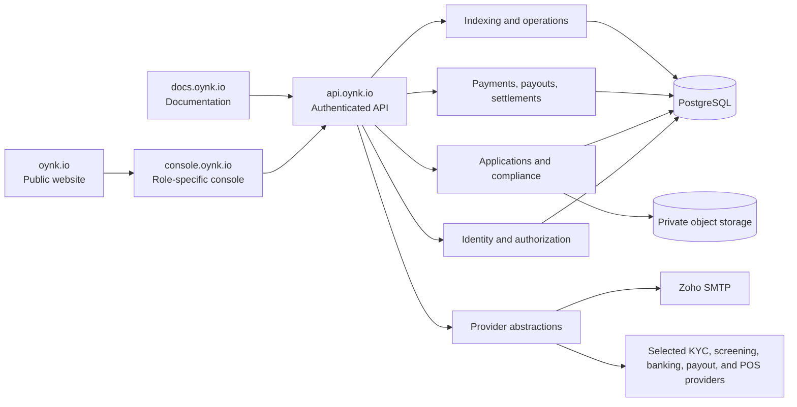

# Oynk platform implementation plan

Date: 2026-08-06

Status: Proposed for review. No implementation phase is authorized by this document.

## Architecture principles

1. Preserve the working indexing subsystem and existing API compatibility.
2. Put shared contracts in `@oynk/shared`, business and security logic in `@oynk/api`, and presentation in `@oynk/web`.
3. Use explicit forward-only migrations; do not edit historical migrations or automatically reset data.
4. Establish organization and permission boundaries before creating customer-facing records.
5. Store money as decimal strings at API boundaries and exact numeric values in PostgreSQL.
6. Treat every state transition as validated, idempotent, authorized, and auditable.
7. Keep blockchain observations distinct from the authoritative payment ledger.
8. Keep compliance documents private and outside PostgreSQL; store only metadata and provider references.
9. Represent incomplete integrations honestly as sandbox, pilot, waitlist, planned, or not connected.
10. Introduce one reviewable capability at a time and require migration, test, typecheck, and build evidence at each phase.

## Proposed platform boundaries



For the current repository, the public site and console may remain in `@oynk/web` with hostname-aware entry and route guards. A separate console application should be reconsidered only if build security, deployment cadence, or bundle isolation becomes a demonstrated problem.

## Database migration plan

Migration numbers below are illustrative and must be allocated against the repository's actual migration history at implementation time.

### Identity foundation

`002_identity_and_organizations.sql`

- `users`: normalized email, password hash, user status, verification timestamps, password-change timestamp, failed-auth counters, and lifecycle timestamps.
- `organizations`: type, status, legal/display names, platform mode, country/timezone/default currency, activation metadata, and lifecycle timestamps.
- `organization_memberships`: user, organization, membership status, role assignment, invitation metadata, and uniqueness constraints.
- `roles`, `permissions`, `role_permissions`, and membership-role association, unless a reviewed static-role model is chosen.
- Constraints and indexes for normalized email, active membership lookup, organization status, and permission evaluation.

`003_sessions_otp_and_audit.sql`

- `sessions`: token hash only, user, active organization, pre-auth/session type, expiry, last used, rotation lineage, revocation, IP/user-agent metadata with a documented retention policy.
- `otp_challenges`: purpose, subject, hash, salt/key version, attempts, issuance, expiry, cooldown, consumption, invalidation, and request metadata.
- `password_reset_tokens` and `email_verification_tokens` only if their lifecycle cannot be safely represented by purpose-scoped challenges.
- `audit_logs`: append-oriented actor, organization, action, resource, result, request ID, environment, limited network/session metadata, and structured redacted details.
- Indexes for live session lookup, challenge lookup, expiry cleanup, rate-limit windows, and audit queries.

### Compliance foundation

`004_applications_and_compliance.sql`

- `business_applications`, `partner_applications`, `compliance_profiles`, `business_profiles`, and `partner_profiles`.
- `addresses`, `directors`, `authorized_representatives`, and `beneficial_owners` with effective dates and review status.
- `compliance_requirements`, `compliance_reviews`, `compliance_events`, and `supporting_comments`.
- Versioned declarations including signatory, policy version, submission timestamp, and immutable submission snapshot/reference.

`005_document_metadata.sql`

- `document_uploads`: private object key, provider, version, hash, MIME type, byte size, status, requirement, owner organization/application, expiry, scan status, reviewer decision, and retention metadata.
- Never store document bytes, public URLs, or storage credentials.

### Network and provider foundation

`006_geography_corridors_and_capabilities.sql`

- `countries`, `currencies`, `corridors`, `partner_corridor_applications`, `partner_capabilities`, and `partner_liquidity_profiles`.
- Corridor availability and approval must be explicit and environment scoped.
- Settlement wallet records contain public addresses only; private keys are prohibited.

### Payment products

`007_payments_and_events.sql`

- `payments`, `payment_events`, `service_payment_details`, `payment_requests`, `payment_links`, and `refunds`.
- Organization-scoped idempotency keys, external references, exact amounts/fees/rates, status transitions, and immutable event history.

`008_payouts_and_beneficiaries.sql`

- `beneficiaries`, `payouts`, `payout_approvals`, `payout_attempts`, and batch/bulk payout metadata.
- Sensitive bank details should be tokenized or held by the selected provider rather than stored as plaintext.

`009_authoritative_settlements.sql`

- Payment-linked settlement records, origin and destination legs, provider assignments, evidence references, deadlines, state events, exceptions, and reconciliation records.
- Existing indexed transfers link by stable references; heuristic pairing remains non-authoritative.

### Terminals and communications

`010_terminals_and_locations.sql`

- `merchant_locations`, `terminal_applications`, `terminals`, `terminal_assignments`, transport routes/vehicles where approved, health snapshots, and lifecycle events.

`011_notifications_and_deliveries.sql`

- `notifications`, preferences, `email_deliveries`, webhook endpoints/deliveries, and redacted delivery attempts.

Every migration must include rollback guidance, even when rollback is a forward corrective migration rather than destructive down SQL. Migrations must be exercised against an empty database and a copy of the current schema before release.

## Authentication design

### Credential flow

1. Normalize email consistently and look up the user without revealing whether it exists.
2. Verify a memory-hard password hash using a reviewed algorithm and parameters.
3. If valid and the account may authenticate, create a narrowly scoped, short-lived pre-authentication challenge—not a full application session.
4. Generate and deliver a six-digit OTP for `SIGN_IN`.
5. Verify the challenge subject, purpose, hash, expiry, attempt budget, consumption state, and rate limits atomically.
6. Consume the challenge and create a new opaque authenticated session in one database transaction.
7. Resolve permitted organizations and require an explicit organization selection when more than one is available.
8. Redirect only to a validated same-application relative path.

### Password storage decision

Preferred: Argon2id through a maintained library with pinned, benchmarked parameters. This adds a dependency and may add native deployment requirements, so it requires explicit approval and deployment verification. A Node `scrypt` implementation is the dependency-free fallback. Password policy, breached-password checking, and recovery policy require product/security approval before implementation.

### Session model

- Generate at least 256 bits of cryptographically secure randomness.
- Store only a keyed hash of the session token.
- Send a host-only cookie from `api.oynk.io` where deployment permits; avoid a parent-domain cookie unless a concrete cross-subdomain requirement justifies it.
- Set `HttpOnly`, `Secure` in production, `SameSite=Lax`, an explicit path, and an explicit maximum age.
- Rotate after OTP completion and sensitive authentication changes.
- Revoke on logout, password reset, account suspension, membership removal, and security response.
- Update last-used time with write throttling to avoid a write per request.
- Validate active user, organization, membership, account status, platform mode, and permission on every protected request.

### CSRF and redirect safety

- Require credentialed requests from an allowlisted `Origin` for state-changing browser calls.
- Add a session-bound CSRF token strategy for mutations; do not rely on SameSite alone.
- Accept `returnTo` only when it is a relative path beginning with one slash; reject protocol-relative paths, encoded bypasses, backslashes, schemes, and foreign origins.
- Keep machine API authentication separate from browser sessions.

### Account gates

- `PENDING_VERIFICATION`: may verify email only.
- `ACTIVE`: may authenticate, subject to organization status and permissions.
- `SUSPENDED` or `DISABLED`: no new sessions; existing sessions revoked.
- Organization status determines access to sandbox, onboarding, review-only, or active operations.
- A frontend mode switch never grants LIVE access.

## OTP and Zoho email design

### Challenge security

- Generate six digits with a cryptographically secure random source and unbiased range selection.
- Hash with a server-side pepper plus per-challenge salt and purpose/subject binding; never store or log plaintext.
- Default expiry: 10 minutes. Default maximum attempts: 5. Default resend cooldown: 60 seconds, all configurable within safe bounds.
- Resend invalidates older active challenges for the same subject and purpose.
- Rate limits apply by account/subject, IP risk key, purpose, and delivery destination and must be shared across processes.
- Verification increments attempts and consumes success atomically to prevent races.
- Security events record issuance outcome, failed verification, lockout, success, and delivery failure without the code.

### Provider abstraction

```ts
interface EmailProvider {
  verifyConnection(): Promise<void>;
  send(message: EmailMessage): Promise<EmailDeliveryResult>;
}
```

- `ZohoSmtpEmailProvider` reads configurable host, port, secure mode, username, application password, sender, and reply-to values from validated server configuration.
- `DevelopmentEmailProvider` is permitted only in development and may expose a local preview without sending secrets to the browser.
- The email service renders branded HTML and plain text, applies timeout and bounded retry policy, and stores redacted delivery outcomes.
- Retry transient connection and provider failures with jitter; do not retry permanent recipient failures indefinitely.
- `pnpm email:test -- --to <verified-address>` must refuse production use without an explicit operational guard and must never print credentials.

### Required templates

Sign-in OTP, email verification, welcome, application receipt, compliance reminder/submission/information request, approval/rejection, activation, password reset/change, invitation, and sensitive-security alert. Templates must be snapshot tested, include accessible text alternatives, and distinguish security codes from clickable recovery links.

## Compliance data model

### Core model

- An organization owns one current business or partner application and versioned submissions.
- A compliance profile records workflow state, risk tier, current requirement set, provider verification references, and review ownership.
- Requirements are configuration-driven by organization type, country, capability, and risk—not hard-coded in forms.
- Addresses, directors, representatives, and beneficial owners are versioned records connected to a submission.
- The beneficial-ownership threshold defaults to a configurable 25 percent but is never presented as a universal legal rule.
- Documents are immutable versions in private object storage with review and malware-scan state.
- Reviewer decisions and additional-information requests are append-oriented events.
- Approval and activation remain separate, permission-protected transitions.

### State controls

Each application type receives an explicit transition table in API code and tests. No endpoint accepts an arbitrary next status. Submission validates the complete requirement snapshot; review actions require internal permissions; activation requires approval plus operational readiness. Rejection and suspension require a reason and audit event.

### Privacy boundaries

- Never place personal data, document content, or private banking details on-chain.
- Minimize data returned to list endpoints and partner opportunity views.
- Encrypt storage and backups and define field-level protection for high-risk identity data.
- Use provider references for external KYC results and tokenized banking details.
- Define retention, deletion holds, legal basis, regional residency, and reviewer-access policy before collecting production documents.

## Route architecture

### Domain behavior

- `oynk.io`: public marketing, product education, signup entry points, and contact flows.
- `console.oynk.io`: authentication and role-specific application routes.
- `api.oynk.io`: API only; no marketing-page session assumptions.
- `docs.oynk.io`: public documentation with clearly labeled implementation status.

### Console resolver

After authentication, `/` or `/dashboard` resolves from active organization type:

- `BUSINESS` -> `/business/home`
- `SETTLEMENT_PARTNER` -> `/partner/home`
- `INTERNAL` -> `/internal/applications`

Users with multiple organizations choose an organization before entering a scoped route. A route guard validates organization type and permission server-side; the client guard improves navigation but is not an authorization boundary.

### Business route groups

| Group | Routes |
| --- | --- |
| Home | `/business/home` |
| Payments | `/business/payments/transactions`, `/links`, `/requests`, `/services`, `/refunds` |
| Payouts | `/business/payouts/new`, `/bulk`, `/beneficiaries`, `/history` |
| Cross-border | `/business/cross-border/transfers`, `/quotes`, `/recipients`, `/settlements` |
| Point of sale | `/business/pos/terminals`, `/locations`, `/devices`, `/transactions`, `/staff` |
| Settlements | `/business/settlements/history`, `/expected`, `/reconciliation`, `/destinations` |
| Developers | `/business/developers/api-keys`, `/webhooks`, `/api-logs` |
| Organization | `/business/compliance`, `/team`, `/roles`, `/bank-accounts`, `/wallets`, `/notifications`, `/settings` |
| Support | `/business/support/cases`, `/business/support/contact` |

### Partner route groups

| Group | Routes |
| --- | --- |
| Home | `/partner/home` |
| Opportunities | `/partner/opportunities/available`, `/assigned`, `/quotes` |
| Execution | `/partner/execution/origin`, `/destination`, `/on-chain`, `/evidence`, `/claims` |
| Liquidity | `/partner/liquidity/fiat`, `/on-chain`, `/commitments`, `/rebalancing`, `/limits` |
| Corridors | `/partner/corridors/active`, `/requested`, `/capacity`, `/pricing`, `/hours` |
| Performance | `/partner/performance/overview`, `/disputes`, `/earnings` |
| Compliance | `/partner/compliance/profile`, `/licenses`, `/policies`, `/documents`, `/owners`, `/reviews` |
| Developers | `/partner/developers/api-keys`, `/webhooks`, `/api-logs` |
| Organization | `/partner/organization/team`, `/roles`, `/wallets`, `/bank-accounts`, `/notifications`, `/settings` |
| Support | `/partner/support/cases`, `/incidents`, `/escalations` |

### Internal route groups

Internal routes cover applications, businesses, partners, compliance reviews, payments, settlements, liquidity requests, corridors, terminals, risk alerts, support, audit logs, system operations, indexing, and configuration under `/internal/*`. Routes are permission-filtered, and sensitive actions require fresh authorization/OTP where risk policy requires it.

## Roles and permission matrix

The initial permission catalog should use the explicit strings below. `read` access is never implied by a similarly named mutation permission unless the policy intentionally includes it.

| Role | Organization type | Core permissions |
| --- | --- | --- |
| `BUSINESS_OWNER` | Business | All business-scoped permissions; membership and owner transfer remain specially guarded |
| `BUSINESS_ADMIN` | Business | `payments:*`, `payouts:*`, `terminals:manage`, `settlements:read`, `organizations:manage`, `members:manage`, `api_keys:manage`, `webhooks:manage`, `compliance:submit`, `audit_logs:read` |
| `FINANCE_MANAGER` | Business | `payments:read`, `payments:refund`, `payouts:read`, `payouts:create`, `payouts:approve`, `settlements:read`, `audit_logs:read` |
| `PAYMENTS_OPERATOR` | Business | `payments:read`, `payments:create`, limited `payments:refund`, `payouts:read` |
| `PAYOUT_APPROVER` | Business | `payouts:read`, `payouts:approve`, `settlements:read` |
| `DEVELOPER` | Business/Partner | `api_keys:manage`, `webhooks:manage`, scoped API-log read, documentation access |
| `SUPPORT_VIEWER` | Business | Read-only payment/payout/support access with sensitive fields minimized |
| `AUDITOR` | Business/Partner | Read-only operational data plus `audit_logs:read`; no secrets or document download by default |
| `PARTNER_OWNER` | Partner | All partner-scoped permissions; owner transfer specially guarded |
| `PARTNER_ADMIN` | Partner | Partner operations, membership, compliance submission, integration management, and audit read |
| `LIQUIDITY_MANAGER` | Partner | `liquidity:read`, `liquidity:quote`, `liquidity:commit`, corridor and settlement read |
| `SETTLEMENT_OPERATOR` | Partner | `settlements:read`, `settlements:execute`, evidence submission within assigned requests |
| `PAYOUT_OPERATOR` | Partner | Assigned destination payout read/execute and evidence submission |
| `COMPLIANCE_MANAGER` | Partner | `compliance:read`, `compliance:submit`; no internal review decision |
| `PLATFORM_OWNER` | Internal | Full platform permissions with high-risk actions requiring step-up authentication and audit |
| `COMPLIANCE_ADMIN` | Internal | `compliance:read`, `compliance:review`, reviewer assignment, approval/rejection recommendations, policy configuration as separately granted |
| `COMPLIANCE_REVIEWER` | Internal | Assigned application review and information requests; activation is not implicit |
| `PARTNER_OPERATIONS` | Internal | Partner/corridor/liquidity operations and `accounts:activate` where explicitly granted |
| `PAYMENT_OPERATIONS` | Internal | Payment, payout, settlement, exception, and reconciliation operations |
| `RISK_ANALYST` | Internal | Risk/compliance read, risk flags, escalation; no account activation by default |
| `TECHNICAL_ADMIN` | Internal | API/webhook/system operations, `indexing:read`, `indexing:run`; no compliance approval by default |
| `SUPPORT_AGENT` | Internal | Minimized customer and case read, comments, escalations; no payment mutation by default |
| `INTERNAL_AUDITOR` | Internal | Read-only audit, compliance decisions, and operational history |

Wildcard notation above is documentation shorthand only. The implementation should expand roles into explicit permission rows such as `payments:read`, `payments:create`, `payments:refund`, `payouts:read`, `payouts:create`, `payouts:approve`, `terminals:read`, `terminals:manage`, `settlements:read`, `settlements:execute`, `liquidity:read`, `liquidity:quote`, `liquidity:commit`, `compliance:read`, `compliance:submit`, `compliance:review`, `organizations:manage`, `members:manage`, `api_keys:manage`, `webhooks:manage`, `audit_logs:read`, `indexing:read`, `indexing:run`, `applications:approve`, `applications:reject`, `accounts:activate`, and `accounts:suspend`.

## Implementation sequence and exit criteria

### Phase 1: identity, organizations, permissions, sessions, OTP records, audit logs

- Approve password algorithm, session-cookie topology, data retention, internal-owner bootstrap, and role matrix.
- Add explicit migrations and shared contracts.
- Add configuration validation without real secrets.
- Implement repositories and isolated security primitives with unit/integration tests.
- Do not expose incomplete signup or login UI yet.

Exit: migrations work on empty and upgraded disposable databases; permission-denial, tenant-isolation, token-hash, expiry, rotation, open-redirect, and audit tests pass.

### Phase 2: email provider and OTP delivery

- Add the approved SMTP dependency without unrelated upgrades.
- Implement Zoho and development adapters, templates, retries, delivery records, connection verification, and guarded test command.
- Update `.env.example` with placeholders.

Exit: template, redaction, configuration, transient/permanent failure, retry, and development-adapter tests pass; a controlled Zoho staging delivery is manually verified.

### Phase 3: authentication UI and protected routing

- Add signup choice, login, OTP, recovery, invitation, denial, current-session, organization selection, logout, CSRF, and route guards.
- Preserve existing dashboard URLs through compatibility redirects.

Exit: password-plus-OTP flow, cookie flags, CSRF, logout, status gates, open-redirect prevention, and protected-route end-to-end tests pass.

### Phase 4: business onboarding

- Add application/profile migrations, resumable drafts, configurable requirements, document metadata, declarations, and business onboarding UI.
- Add persistent compliance and platform-mode banners.

Exit: draft, validation, resume, submission snapshot, organization scope, and mobile form tests pass. No live payment permission is granted.

### Phase 5: partner onboarding

- Extend core KYB with capability, corridor, liquidity, licensing, operational, AML, and technical sections.
- Treat individual/sole-proprietor applications as manual-review-only if policy permits them.

Exit: capability/corridor validation, risk-review transitions, submission, review visibility, and data minimization tests pass.

### Phase 6: internal review and activation

- Implement reviewer queues, checklists, comments, additional-information requests, decisions, escalation, suspension, and explicit activation.
- Require appropriate permissions and step-up verification for high-risk actions.

Exit: state-transition, separation-of-duties, authorization-bypass, audit completeness, and concurrent-review tests pass.

### Phase 7: role-specific console shells

- Implement business, partner, and internal route layouts with server-derived navigation.
- Move current indexing views into the internal operations area while retaining legacy route compatibility.

Exit: navigation, organization switching, permission visibility, direct-route denial, responsive, and accessibility tests pass.

### Phase 8: payments, service payments, payouts, and settlement contracts

- Establish authoritative ledgers, event models, idempotency, approval workflows, exact arithmetic, pagination, and UI states.
- Integrate an external processor only after provider and reconciliation design approval.

Exit: state machines, duplicate requests, exact amount math, tenant boundaries, approval separation, reconciliation, and failure recovery pass.

### Phase 9: POS and transport architecture

- Implement applications, waitlist/pilot states, locations, inventory, assignments, and provider adapter.
- Keep low-connectivity behavior accurately bounded and risk-controlled.

Exit: no hardware is labeled available without provider evidence; assignment, deactivation, reconciliation, and offline-risk documentation pass review.

### Phase 10: partner liquidity and execution

- Add approved opportunity visibility, quote/assignment lifecycle, limits, evidence, exception, claims, and corridor capacity.

Exit: authorization, information minimization, idempotency, concurrency, deadline, and audit tests pass.

### Phase 11: public website and consumer positioning

- Expand the public site to the holistic product portfolio with honest availability labels.
- Use `VITE_CONSUMER_PRODUCT_NAME`, recommending “Oynk Pay” while retaining “Tap by Oynk” as an unresolved brand alternative.

Exit: every CTA resolves, claims are evidence reviewed, preview products are labeled, and responsive/accessibility checks pass.

### Phase 12: developer tooling and public docs

- Add secure API-key lifecycle, webhook signing/delivery, API logs, sandbox documentation, and the requested public product/API pages.

Exit: secrets are shown once only, hashes are stored, rotations/revocations work, webhook retries are safe, and docs match implemented APIs.

### Phase 13: hardening and release review

- Complete threat model, accessibility, performance, security headers, distributed rate limiting, backup/restore, monitoring, CI, and deployment exercises.

Exit: all configured quality gates pass, high-severity security findings are resolved or explicitly block release, and external integrations are validated in staging.

## Environment plan

The requested application, authentication, Zoho, and storage variables should be added only with the phase that consumes them. Configuration must fail closed in production while allowing an explicit development email/storage adapter locally. Frontend variables are public by definition and must never contain SMTP, auth pepper, storage secret, or provider credentials.

`VITE_CONSUMER_PRODUCT_NAME` is presentation-only. `PLATFORM_MODE` and organization activation are authoritative server state; a `VITE_*` value must never enable LIVE behavior.

## Required commands by maturity stage

The repository already exposes core build, typecheck, test, database, and indexer commands. Add commands only with their working implementations:

- Phase 1: `create:internal-owner`, `auth:audit`, `permissions:audit`, `db:status`
- Phase 2: `email:test`
- Phase 4/5: `compliance:audit`, protected test-business and test-partner creation
- Phase 13: configured `lint` and CI-equivalent quality command

Test-account creation must require development/test environment and explicit confirmation or a non-production database guard.

## Risks and unresolved decisions

1. **Regulatory scope:** countries, payment activities, partner categories, consumer availability, and required licenses require qualified legal/compliance review.
2. **Consumer name:** recommend “Oynk Pay” for clarity; keep it configurable until brand and trademark review selects between it and “Tap by Oynk.”
3. **Password implementation:** approve Argon2id dependency/deployment or Node scrypt before Phase 1.
4. **Tenant ownership of indexed data:** decide which transfers are internal-only and how organization-visible records are linked without leaking tracked-wallet activity.
5. **Database isolation:** decide whether compliance/identity and blockchain analytics use separate databases or separately privileged schemas.
6. **Session topology:** validate production reverse proxy, CORS origins, host-only API cookie behavior, CSRF, and local development across ports.
7. **Internal owner bootstrap:** define a one-time, audited, production-safe procedure with no default credentials.
8. **Email:** verify Zoho sender/domain, regional host, application password process, sending limits, bounce handling, and SPF/DKIM/DMARC.
9. **Storage:** select S3-compatible provider, malware scanner, residency, encryption, retention, legal hold, and signed-link policy.
10. **KYC and screening:** select providers and define manual fallback, webhook verification, case handling, and data-retention boundaries.
11. **Payments and payouts:** select processors/banks and define ledger ownership, prefunding, safeguarding, reconciliation, chargeback/refund, and failure semantics.
12. **POS:** define hardware/provider, certification, connectivity, key management, fleet management, and pilot regions.
13. **Offline-assisted payments:** complete threat and loss-limit design; do not call the product fully offline while a merchant or network connection is required.
14. **Role policy:** approve exact permissions, separation of duties, step-up actions, and emergency access before seeding roles.
15. **Data retention:** define retention and erasure requirements for identity, compliance, audit, session, delivery, and financial records.
16. **Terms and privacy:** supply verified legal URLs, policy versions, consent text, and authorized declaration language.
17. **Migration baseline:** replace application bootstrap gradually without editing historical migrations or risking existing indexed data.
18. **Routing dependency:** the current lightweight router is insufficient for the target application; adopting a routing library changes dependencies and lockfile and requires approval.
19. **Email dependency:** SMTP implementation similarly requires an approved maintained library unless a reviewed low-level implementation is chosen.
20. **Testing infrastructure:** API unit tests exist, but frontend component/accessibility/E2E tools are absent and require dependency approval.
21. **Deployment targets:** hosting providers and DNS targets remain unselected; documentation must use provider-issued placeholders.
22. **Production readiness:** visual completion cannot override unresolved identity, legal, integration, ledger, operational, and incident-response controls.

## Approval requested for the next phase

Before Phase 1 begins, approve or revise:

- The identity migration boundary.
- Argon2id versus Node scrypt.
- Database/schema isolation strategy.
- Host-only API session cookie and CSRF approach.
- Static database-backed role catalog and the matrix above.
- Internal-owner bootstrap policy.
- Retention defaults for sessions, authentication events, and audit metadata.

No later product phase should begin until Phase 1 passes its migration, security, typecheck, test, and build gates.
